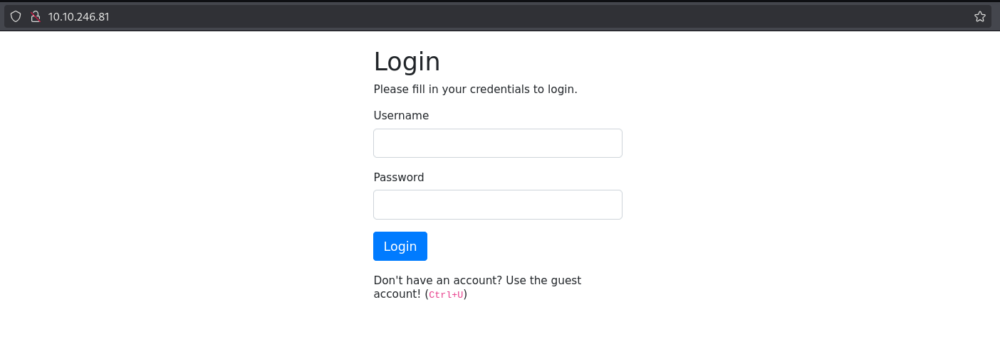
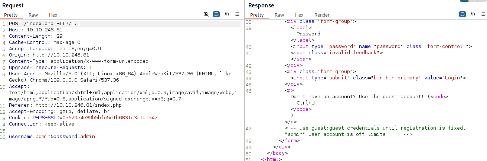
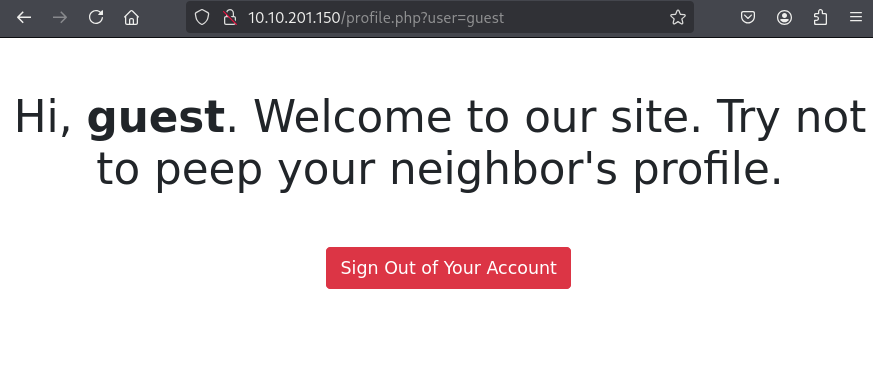
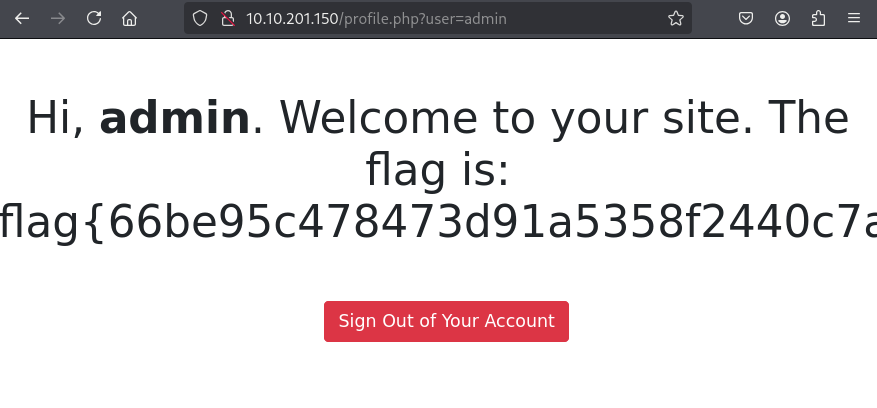

# Neighbour-newapp

Navigate to the website URL (http://MACHINE_IP) — you find a login page.

I tried entering random credentials; the server responded with **_Invalid username or password_**.

Let's check the request and response using **_`Burp Suite`_**.

In the HTML returned by the server, we can see an interesting comment: `<!-- use guest:guest credentials until registration is fixed. "admin" user account is off limits!!!!! -->`.

So there is a user called **_`admin`_**, but we don't have their password.

I logged in with the guest credentials to see what happens.

I noticed the username is included as a parameter in the request URL... hmmm interesting. What if we try another username?

Since I know the username admin exists, I changed the user parameter to **_admin_**.

Boom — an IDOR. We can access the admin account without credentials, where we find the flag.
