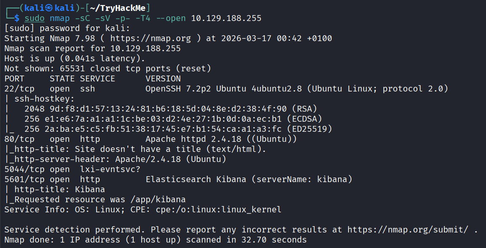
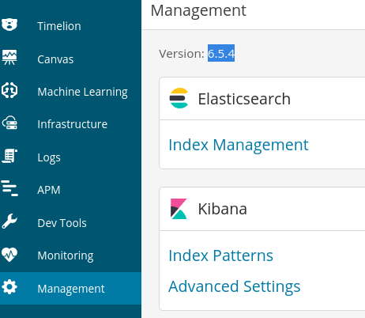

## Prototype-based inheritance

Prototype-based inheritance is a core mechanism in JavaScript that enables objects to inherit properties and methods from other objects directly, without relying on classes. Each object has an internal link called [[Prototype]] (accessed via **proto** or Object.getPrototypeOf()) pointing to another object—the prototype. When a property or method is accessed on an object and isn't found, JavaScript automatically looks up the prototype chain until the property is found or the chain ends at null.

## Prototype-based inheritance vulnerability

Prototype-based inheritance vulnerability refers to a class of security flaws in JavaScript applications where attackers exploit the dynamic nature of prototype chains to inject or modify properties on base object prototypes like Object.prototype. This allows malicious values to be inherited by all objects in the application, leading to severe consequences such as denial of service (DoS), privilege escalation, or remote code execution (RCE).

## 1. What is the vulnerability that is specific to programming languages with prototype-based inheritance?

Answer: `Prototype Pollution`

## 2. What is the version of visualization dashboard installed in the server?

1. We browse to `http://<Target IP>:5601`
2. under Managemnt tab

   

## 3. What is the CVE number for this vulnerability?

Answer: `CVE-2019-7609`

## 4. Compromise the machine and locate user.txt

# disappointed! i Got a problem with the room, i tried many payloads(all payloads and modules that exist on internet xd) to get a reverse shell, but it does not work.
