# CTF Write-Up: Smol

## Challenge Overview

- **Name:** Advent of Cyber '23 Side Quest
- **Difficulty:** Hard
- **Category:**
- **Description:**  
   https://tryhackme.com/room/adventofcyber23sidequest

## 1. Task 1 (The return of Yeti)

### SQ1. The return of Yeti

#### What's the name of the WiFi network in the PCAP?

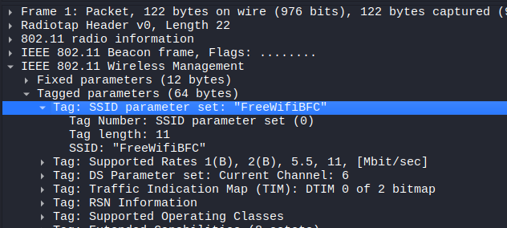

#### What's the password to access the WiFi network?

Aircrack-ng does not support new .pcapng files so i transformed our file to a classic .pcap file.

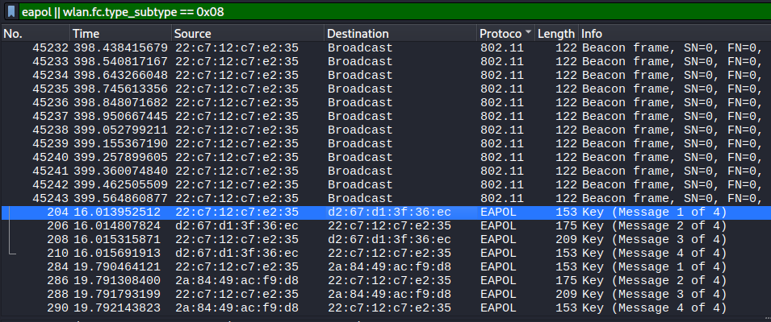
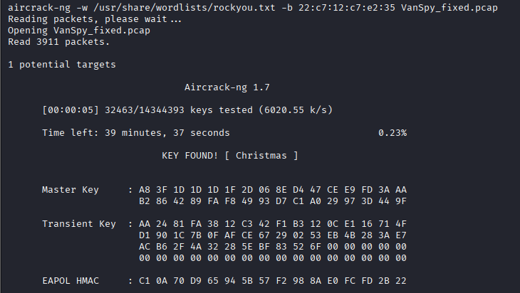

#### What suspicious tool is used by the attacker to extract a juicy file from the server?

First, We have to decrypt the .pcapng file using the password we got.

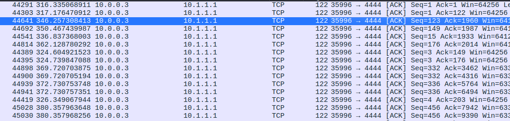
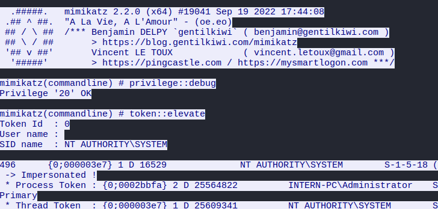

#### What is the case number assigned by the CyberPolice to the issues reported by McSkidy?

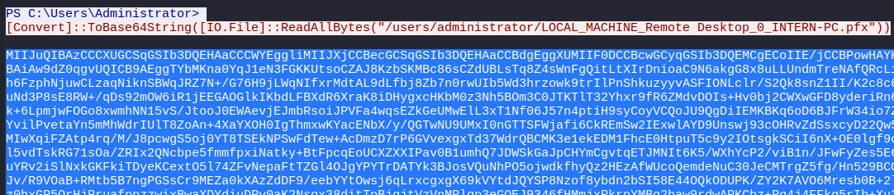
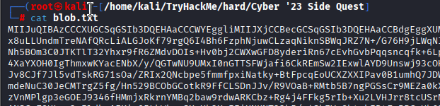
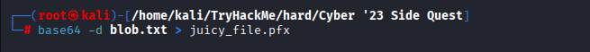
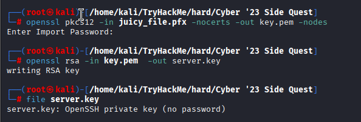
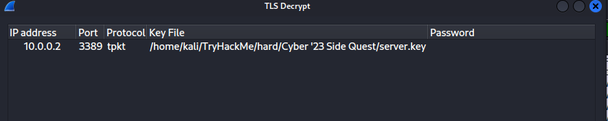
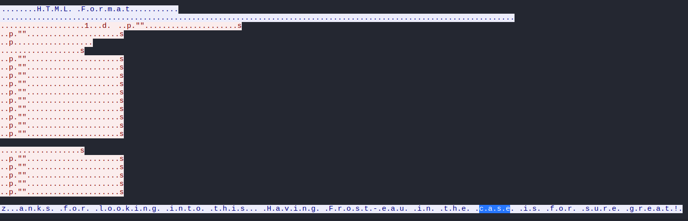
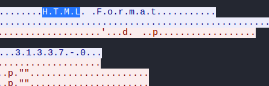

#### What is the content of the yetikey1.txt file?

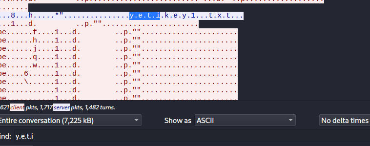
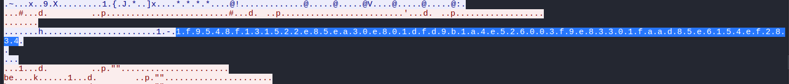
