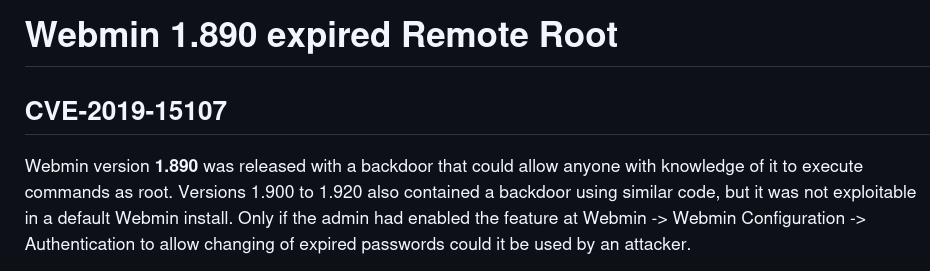
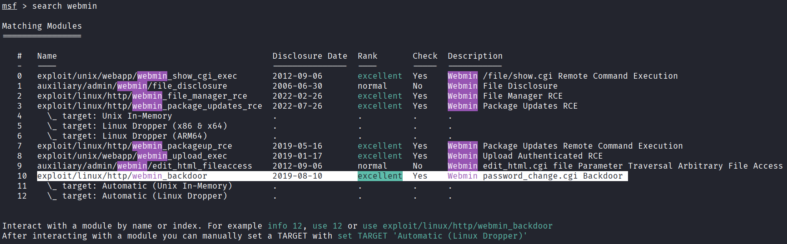
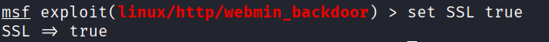
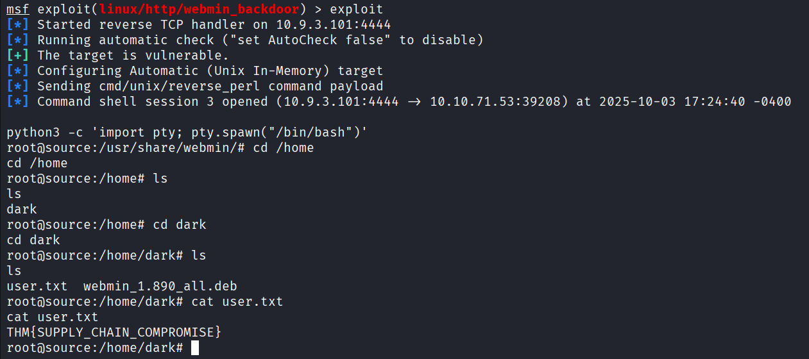
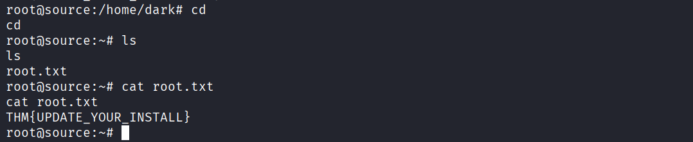

# Source

Exploit a recent vulnerability and hack Webmin, a web-based system configuration tool.

## Task

First we scan our target using nmap

We identified the Webmin version as `1.890`.

I searched online for vulnerabilities and found this:

Source: https://github.com/n0obit4/Webmin_1.890-POC

> for more information about the vulnerability (CVE-2019-15107) check: https://www.pentest.com.tr/exploits/DEFCON-Webmin-1920-Unauthenticated-Remote-Command-Execution.html

Let's search Metasploit for the relevant exploit.

We set options

We should set SSL to _true_ because Webmin in that configuration serves over HTTPS, `SSL true` tells the module to use TLS (`https://`) so the exploit’s checks and requests match the service’s protocol.

When we run the exploit, a shell session is opened, allowing us to access files on the server and retrieve the flags.

