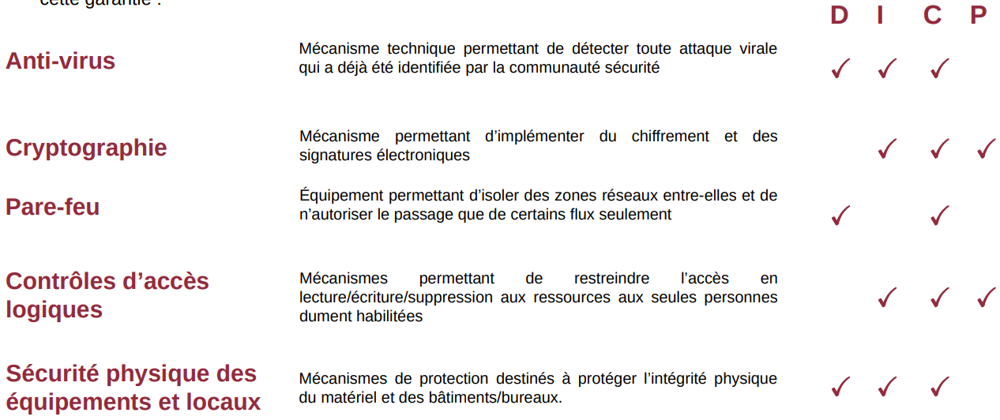
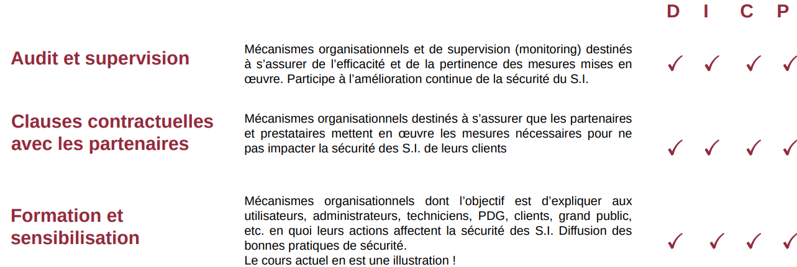

# Foundations of Information Systems Security

## The challenges of Information Systems security

### What is an Information System?

Set of resources intended to collect, classify, store, manage, and disseminate information within an organization (The IS must facilitate the organization's mission)

An organization's information system contains a set of assets:

- **_Primary assets – the most important things_**

  _Business processes and information_ – the actual data and activities that give the organization its value.

- **_Supporting assets – everything that allows those primary assets to work_**
  - **Site** – offices, data centers, physical locations.
  - **People** – employees, contractors, anyone using or running the system.
  - **Hardware** – servers, computers, storage devices.
  - **Network** – internal and external connections.
  - **Software** – applications and operating systems.
  - **Organization** – procedures, management structures, and policies.

**_Information system security means ensuring the security of all these assets._**

### Challenges

The goal of security is to **_reduce risks_** to the information system, to **_limit their impact_** on the operations and business activities of organizations.

Information-system security management is not about creating obstacles, it enhances service quality for users and ensures staff receive the protection they deserve.

#### Which departments within a company are impacted by IS security?

Information-system security affects every major business area: finances, legal/regulatory compliance, organizational operations, and the company’s image and reputation.  
A breach can create financial loss, legal penalties, internal disruption, and damage to public trust.

#### Why are hackers interested in organizations' information systems or individuals computers?

Hackers go after companies and people to make money, like stealing and selling data, demanding ransom, or using computers for their own services.  
They also spy for businesses or governments and may threaten to leak or change information.

---

## Les besoins de sécurité

### critères DIC

3 critères sont retenus pour définir le niveau de sécurité d’un bien du S.I, et pour évaluer si ce bien est
correctement sécurisé:

- `Disponibilité`
- `Intégrité`
- `Confidentialité`

1 critère complémentaire est souvent associé au D.I.C:

- `Preuve`

### différence entre sécurité et sûreté

- `Sûreté` Protection contre les dysfonctionnements et accidents involontaires
  - Exemple de risque : saturation d’un point d’accès, panne d’un disque, erreur d’exécution, etc.
  - Quantifiable statistiquement (ex. : la durée de vie moyenne d’un disque est de X milliers d’heures)
- `Sécurité` Protection contre les actions malveillantes volontaires
  - Exemple de risque : blocage d’un service, smodification d’informations, vol d’information
  - Non quantifiable statistiquement, mais il est possible d’évaluer en amont le niveau du risque et les impacts

### évaluation DICP

- pour évaluer si un bien est correctement sécurisé, il faut auditer son niveau de Disponibilité, Intégrité, Confidentialité et de Preuve L’évaluation de ces critères sur une échelle permet de déterminer si ce bien est correctement sécurisé.
- L’expression du besoin attendu peut-être d’origine :
  • `interne` : inhérente au métier de l’entreprise
  • ou `externe` : issue des contraintes légales qui pèsent sur les biens de l’entreprise

#### Exemple d’évaluation DICP

Exemple avec un site institutionnel simple (statique) d’une entreprise qui souhaite promouvoir ses services sur internet

- Disponibilité = **_Très fort_** Un haut niveau de disponibilité du site web est nécessaire, sans quoi l’entreprise ne peut atteindre son objectif de faire connaitre ses services au public
- Intégrité = **_Très fort_** Un haut niveau d’intégrité des informations présentées est nécessaire. En effet, l’entreprise ne souhaiterait pas qu’un concurrent modifie frauduleusement le contenu du site web pour y insérer des informations erronées (ce qui serait dommageable)
- Confidentialité = **_Faible_**
  Un faible niveau de confidentialité
  suffit. En effet, les informations
  contenues dans ce site web sont
  publiques par nature !

- Preuve = **_Faible_**
  Un faible niveau de preuve suffit. En
  effet, ce site web ne permet aucune
  interaction avec les utilisateurs, il
  fournit simplement des informations
  fixes

### Mécanismes de sécurité pour atteindre les besoins DICP

## Notions de vulnérabilité, menace, attaque

`Vulnérabilité` **Faiblesse au niveau d’un bien** (au niveau de la conception, de la réalisation, de l’installation, de la configuration ou de l’utilisation du bien)  
`Menace` **Cause potentielle d’un incident**, qui pourrait entraîner des dommages sur un bien si cette menace se concrétisait.  
`Attaque`** Action malveillante** destinée à porter atteinte à la sécurité d’un bien. Une attaque représente **la concrétisation d’une menace, et nécessite l’exploitation d’une vulnérabilité**.

Ainsi, tout le travail des experts sécurité consiste à s’assurer que le S.I. ne possède aucune vulnérabilité.
Dans la réalité, l’objectif est en fait d’être en mesure de maîtriser ces vulnérabilités plutôt
que de viser un objectif 0 inatteignable.

## Panorama de quelques menaces

### Sources potentielles de `menaces`

deux critere:
**_Capacité_** degré d’expertise et ressources de la source de menaces(expertise, budget..etc)
**_Exposition_** opportunités et intérêts de la source de menaces (niv d'acces aux ressource)

### Deroulement d'une attaque avancée (A faire diapo 77!!!)

### Violation d’accès non autorisé : mots de passe faibles

## Le droit des T.I.C. et l’organisation de la cybersécurité en France
