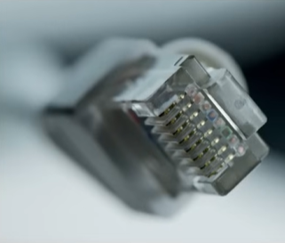

# Interfaces & Cables

## Ethernet

A collection of network protocols & standards. Ethernet standards are defined in the IEEE 802.3 standard in 1983.

- `IEEE` Institute of electrical and electronics engineers.

### Ethernet Standards (copper cables)

- `Base-T` _Base_ for Baseband signaling, _T_ for Twisted pair

## Cooper UTP Cables

- `UTP` _U_ Unshilded, _T_ Twisted (protects against EMI - Electromagnetic Interference -), _P_ pair.
- There is 8 ping in UTP cables (8 wires).
- _10 Base-T/100 Base-T_ use 2 pairs (4 wires).
- _1000 Base-T/10G Base-T_ use 4 pairs (8 wires).

  

### UTP Cables (10 Base-T/100 Base-T)

#### Straight through Cable

In Straight through UTP copper cables, pins 1 and 2 from a client, router, or firewall connect to pins 1 and 2 on a switch, and pins 3 and 6 connect to pins 3 and 6. The client side uses pins 1 and 2 to send data, and the switch uses them to receive — and vice versa for pins 3 and 6 — which gives a full-duplex connection.

When we connect a client to a Sw or R to a Sw, Straight through Cable works fine, But in networks we don't always connect pc to Sw/Sw to R, what if we want to connect a R to R/Sw to Sw/R to client?

#### Crossover Cable

The solution is to use a different type of cables, called **crossover cable** where a pin on one end of the cable does not connect straight to the same pin on the other end, the pairs are reversed on each end.

#### Different devices and the pins they use to transmit and receive data

`Auto MDI-X` Is a feature in network devices that automatically switches the pins used for sending (Tx) and receiving (Rx) data inside the device, so it doesn’t matter what type of Ethernet cable you use — it will just work.

### UTP Cables (1000 Base-T/10G Base-T)

- In 1000/10G Base-t Cables all the 8 wires are used.
- In addition of using all the 4 pairs of wires, each pair is bidirectional. Each pair is not dedicated specifically to transmit or receive data(result: much faster).

  

#### ⚠️ Note

UTP leak signal outside cable, which can be copied (security risk!).

## Fiber-Optic Connections

It uses **SFP transceivers** (Small Form-Factor Pluggable).

We connect a **fiber optic cable** to it.

We can notice that there is two connectors, one for transmitting, the other to receive.

### Cable Structure

- 1 is The fiberglass core.
- 2 is a cladding that reflects light.
- 3 a protective buffer.
- 4 is the outer jacket of the cable.

### Types

#### Multimode Fiber

- Core diameter is wider than Single-mode fiber.
- Multiple angles (Modes).
- Longer cable than UTP, but shorter than Single-mode fiber.
  -Cheaper than Single-mode fiber (LED-based SFP).

#### Single-mode Fiber

- Core diameter is narrower than Multimode fiber.
- Single angle.
- Longer cable than UTP/Multimode cables
- Expensive (Laser-based SFP)

### Fiber Optic Cables Standards

