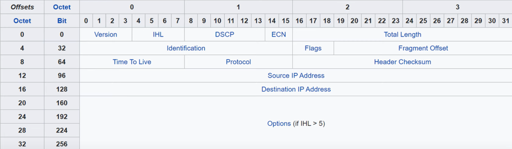
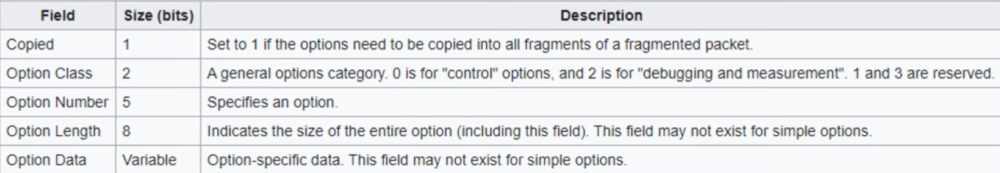

# IPv4 Header

## `Version` 4 bits

- The version of the ip used
  - IPv4 = 4 (0100)
  - IPv6 = 6 (0110)

## `IHL (Internet Header Length)` 4 bits

- The final field of the IPv4 header (Options) is variable in length, so this field is necessary to indicate the total **_length of the header_**.
- Identifies the length of the header in **4-byte increments**
- Value of 5 = 5 x 4-bytes = 20 bytes
- `The min value is 5 (20 bytes)` (The header with an empty Options field)
- `The max value is 15 (60 bytes)` (this mearns that the max size of the Options field is 40 bytes)

## `DSCP (Differentiated Services Code Point)` 6 bits

- Used for `QoS` (Quality of Service)
- Used to prioritize delay-sensitive data (streaming voice
  video, etc.)

## `ECN (Explicit Congestion Notification)` 2 bits

- Provides end-to-end (between two endpoints) notification
  of network congestion **without dropping packets**.
- Optional feature that requires both endpoints, as well as
  the underlying network infrastructure, to support it.

## `Total Length` 16 bits

- Indicates the total length of the packet (L3 header + L4
  segment)
- **Measured in bytes** (not 4-byte increments like IHL)
- `Minimum value of 20` (=IPv4 header with no encapsulated
  data)
- `Maximum value of 65,535` (maximum 16-bit value)

## `Identification` 16 bits

- If a packet is fragmented due to being too large, this field is used to identify which packet the fragment belongs to.
- All fragments of the same packet will have their own IPv4
  header with the same value in this field.
- Packets are fragmented if larger than the `MTU` (Maximum
  Transmission Unit)
- The `MTU is usualy 1500 bytes`

## `Flags` 3 bits

- Used to control/identify fragments.
- Bit 0: Reserved, always set to 0
- Bit 1: Don't Fragment (DF bit), used to indicate a packet
  that should not be fragmented
- Bit 2: More Fragments (MF bit), set to 1 if there are more
  fragments in the packet, set to O for the last fragment

## `Fragment Offset` 13 bits

- Used to indicate the position of the fragment within the
  original, unfragmented IP packet.
- Allows fragmented packets to be reassembled even if the
  fragments arrive out of order.

## `TTL (Time To Live)` 8 bits

- A router will drop a packet with a TTL of 0 Used to prevent infinite loops
- Originally designed to indicate the packet's maximum lifetime in seconds
- In practice, indicates a '`hop count`': each time the packet arrives at a router, the router decreases the TTL by 1.
- `Default recommended TTL is 64`

## `Protocol` 8 bits

- Indicates the protocol of the encapsulated L4PDU
- Value of 6: TCP
- Value of 17: UDP
- Value of 1: ICMP
- Value of 89: OSPF (dynamic routing protocol)

## `Header Ckecksum` 16 bits

- A calculated checksum used `to check for errors in the IPv4 header`.
- When a router receives a packet, it calculates the checksum of the header and compares it to the one in this field of the header.
- If they do not match, the router drops the packet.
- Used to check for errors only in the IPv4 header.
- IP relies on the encapsulated protocol to detect errors in the encapsulated data.
- Both TCP and UDP have their own checksum fields to detect errors in the encapsulated data.

## `Source/Destination IP Adr` 32 bits (each)

## `Options` 0-320 bits

- If the IHL field is greater than 5, it means that Options
  are present.
  
