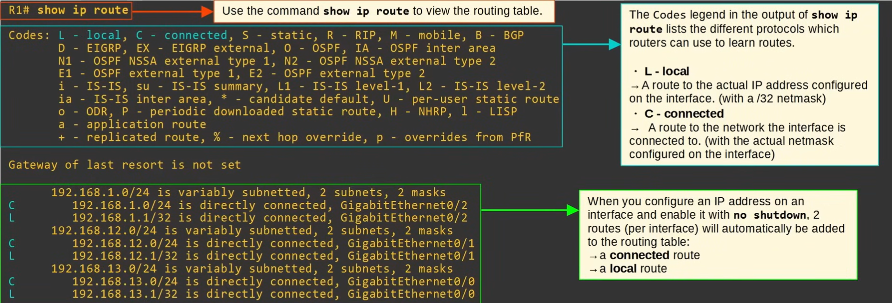
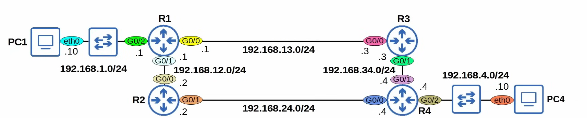
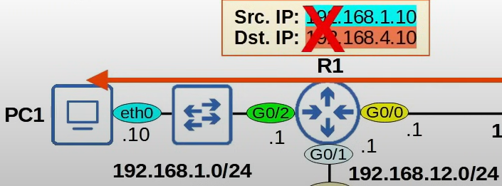
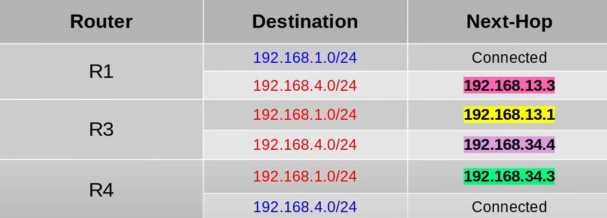
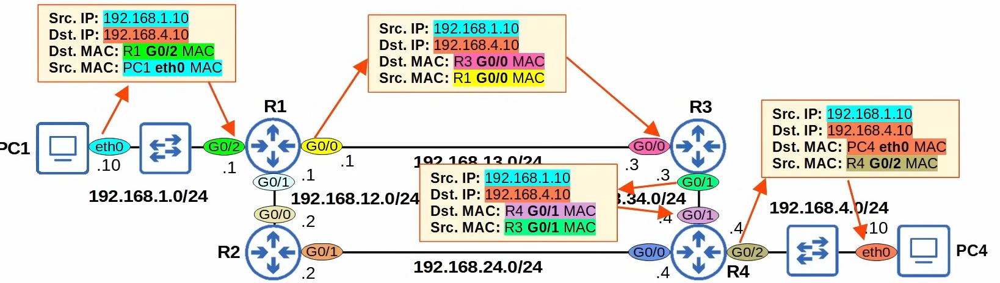

# Routing fundamentals

## What is Routing?

**_Routing_** is the process that routers use to determine the path that IP packets should take over a network to reach their destination.

- Routers store routes to all their known destinations in a `Routing Table`

There are two main routing methods (methods that routers use to learn routes):

- `Dynamic Routing` Routers use dynamic routing protocols (ie. OSPF) to share routing information with each other automatically and build
  their routing tables.

- `Static Routing` A network engineer/admin manually configures routes on the router.

A **_route_** tells the router: to send a packet to destination X, you should send the packet to **next-hop** Y (the next router in the path to the destination).

- If the destination is directly connected to the router, send the packet directly to the destination.
- If the destination is the router's own IP address, receive the packet for yourself (don't forward it).

`R1# show ip route` to view the routing table

### Note

If a router receives a packet and it doesn't have a route that matches the packet's destination, it will `drop` the packet.

- This is different than switches, which **flood** frames if they don't have a MAC table entry for the destination.

If a router receives a packet and it has multiple routes that match the packet's destination, it will use the most specific matching route to
forward the packet.

- **_Most specific_** matching route = the matching route with the longest prefix length.
  → This is different than switches, which look for an **exact** match in the MAC address table to forward frames.

## Static Routing

### Default `Gateway`

- End hosts like PC1 and PC4 can send packets directly to destinations in their connected network.
  - PC1 is connected to 192.168.1.0/24, PC4 is connected to 192.168.4.0/24.
- To send packets to destinations outside of their local network, they must send the packets to their `default gateway`.

  

  - In linux these configurations are stored in a text file that we can edit.

- The default gateway configuration is also called a **_default route_**.
  - It is a route to 0.0.0.0/0 = all netmask bits set to 0. Includes all addresses from 0.0.0.0 to 255.255.255.255.
- End hosts usually have no need for any more specific routes. They just need to know: to send packets outside of my local network, I should send them to my default gateway.

### Static Routes

- In the topology above if PC1 sends a packet to PC4, R1 will drop the packet because he does not know the destination 192.168.4.10/24 (no matching routes in his routing table)
- To properly forward the packet, R1 needs a route to the destination network (192.168.4.0/24).
  - Routes are instructions: To send a packet to destinations in network 192.168.4.0/24, forward the packet to next hop Y.
- In the Topology there is two possible paths to reach PC4, but we will use the pah via R3.

### Static Route Configuration

- Each router in the path needs two routes (a route to 192.168.1.0/24 and a route to 192.168.4.0/24.) to ensure **_two-way reachability_** (PC1 can send packets to PC4, PC4 can send packets to PC1).
- R1 already has a **Connected** route to 192.168.1.0/24. R4 already has a **Connected** route to 192.168.4.0/24.
  - The other routes must be **_manually configured_** (using Static routes).

> To allow PC1 and PC4 to communicate with each other over the network, **_let's configure these Static routes on R1, R3, and R4._**

`R1(config)# ip route <ip-address> <netmask> <next-hop>`

- `R1(config)# ip route 192.168.4.0 255.255.255 192.168.13.3`

Same for the other destinations on every router.

Now if we try to ping PC4 from PC1, the ping should be successful.

### Packet Traveling from PC1 to PC4

- Notice that each time the frame is de-encapsulated and re-encapsulated, the MAC adrs change.

### Static Route Configuration with **_`exit-interface`_**

Instead of specifying the IP adr of the next hop we can put on wich interface teh packet should be sent

- `R2(config)# ip route <ip-address> <netmask> <exit-interface>`

  - `R2(config)# ip route 192.168.1.0 255.255.255.0 g0/0`
  - Now when R2 receives a packet with a destination 192.168.1.0/24, this packet will be sent via g0/0 interface.

- Or we can spacify both `R2(config)# ip route <ip-address> <netmask> <exit-interface> <next-hop>`
  - `R2(config)# ip route 192.168.4.0 255.255.255.0 g0/1 192.168.24.4`

#### Note

Static routes in which you specify only the exit-interface
rely on a feature called _Proxy ARP_ to function.
This is usually not a problem, but generally you can stick to
next-hop or exit-interface next-hop.
**Neither is 'better'** than the other: use which you prefer.

### Default Route On Routers
