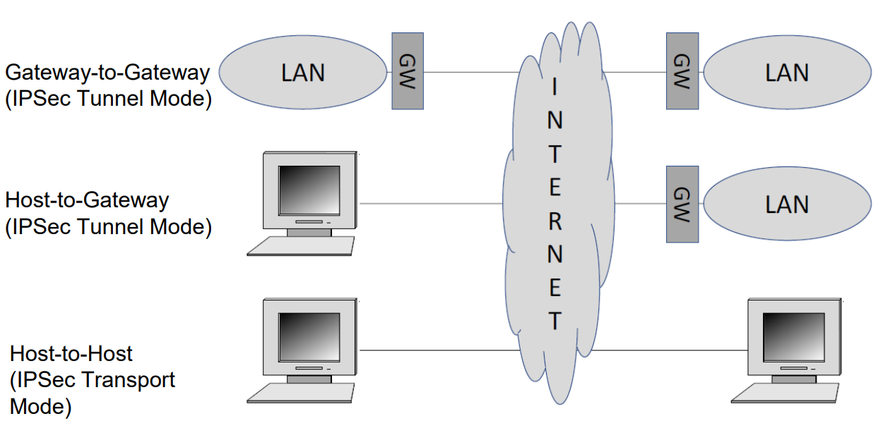

## At which OSI layer should we add security

When we ask “At which OSI layer should we add security?”, the focus is on where encryption, authentication, and integrity checks should be applied to protect communication.

### TLS (Transport Layer Security):

- Ensures confidentiality (by encrypting data), authentication (verifying the server/website identity), and integrity (checking that data hasn’t been changed).
- Widely used in HTTPS, banking, emails, and messaging systems.
- In the OSI model, TLS is associated with the Presentation Layer (Layer 6) because it handles encryption and data representation.
- In practical TCP/IP networking, TLS sits between the Application Layer (7) and the Transport Layer (4). It works on top of TCP, adding a secure layer before the data is delivered to the application.
- Example: HTTPS = HTTP (Application Layer) + TLS (security) + TCP (Transport Layer).

> In summary: TLS security belongs conceptually to the Presentation Layer, but in real-world implementations, it is placed just above TCP, securing communications for applications.

### Security at network level (L3)

- Protects IP packets during transmission.
- Packets can be encrypted at the source (client/server) or at a gateway (network edge), and decrypted at the destination or gateway.
- Provides end-to-end protection for L3-homogeneous networks (e.g., IP networks).
- VPNs (Virtual Private Networks) are a practical application of L3 security:
  - Create encrypted tunnels over public networks.
  - Can operate in transport mode (only payload encrypted) or tunnel mode (entire packet encrypted, new IP header added).
  - Ensure confidentiality, integrity, and authentication of all traffic between networks or remote clients.

#### Deployment scenarios for VPNs

## Why do we need IPSec?

#### IPSec is needed because the original Internet Protocol (IP) was not designed with security in mind

- Connectionless protocol
  - IP does not establish a “connection” between sender and receiver.
  - Packets are sent independently; there’s no guarantee the other side is ready.
- Unreliable
  - Packets may be lost, duplicated, or replayed.
- No ordering guarantee
  - Packets may arrive out of order, which can mess up data if not handled at higher layers.
- Packets can be sniffed `(no privacy)`
  - Anyone with access to the network can capture and read IP packets.
- IP addresses can be spoofed `(no authentication)`
  - Attackers can fake the source IP to impersonate someone else.

#### Techniques to create a VPN (using IPSec)

- Private addressing
  - Using private IP addresses within the organization to hide real internal addresses from the public internet.
- Protected routing (IP tunnel)
  - Encapsulating IP packets inside another IP packet so they can be safely routed over the public internet.
- Cryptographic protection of network packets (secure IP tunnel)
  - Encrypting and authenticating packets using IPSec to create a secure tunnel, preventing eavesdropping, tampering, and spoofing.

## IPSec overview

### What is IPsec?

`Internet Protocol Security` is a set of rules & tools that makes sure data traveling over the Internet is safe.

### What does IPsec do?

Before sending your data, IPsec can:

- Encrypt it `(confidentiality)`→ so nobody can read it.
- Add a signature (MAC) `(integrity + authentication)` → so receiver knows it wasn’t changed & Authenticate sender so you know it’s from the right source.
- Add numbering `(to avoid replay attacks)`→ so old/repeated packets get rejected.

> If the cryptographic algorithms are strong, and the keys are secure then the only possible attack is to stop the communications (DoS attack).

> Also known as `S-VPN` (Secure VPN)

### IPsec packet types (two main ones)

- `AH` (Authentication Header)
  - Protects against tampering and fake packets.
  - Does not hide the data (no encryption).
  - Rarely used today.
- `ESP` (Encapsulating Security Payload)
  - Protects against tampering and hides the data (encryption).
  - This is what most VPNs use.

### Two ways IPsec can work

- `Transport Mode`
  - Only protects the inside (data part) of your packet.
  - Original addresses are still visible.
  - Used when two computers directly talk securely.
- `Tunnel Mode`
  - Protects the whole original packet by wrapping it in a new one.
  - Like putting your letter in a new envelope with a new address.
  - Used for VPNs between offices, or user-to-office.

### How do two sides agree on how to protect data?

They need to agree on:

- What algorithms to use (like “let’s use AES encryption”).
- What keys to use for encryption.
- How long to use them.

This agreement is called a `Security Association (SA)`.
To build it, they use a helper protocol called `IKE (Internet Key Exchange)`.
