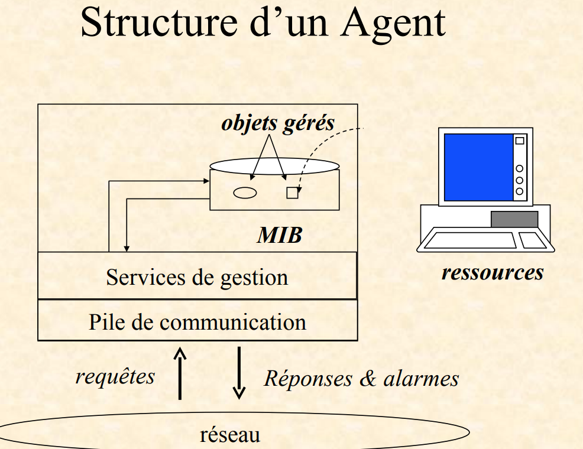
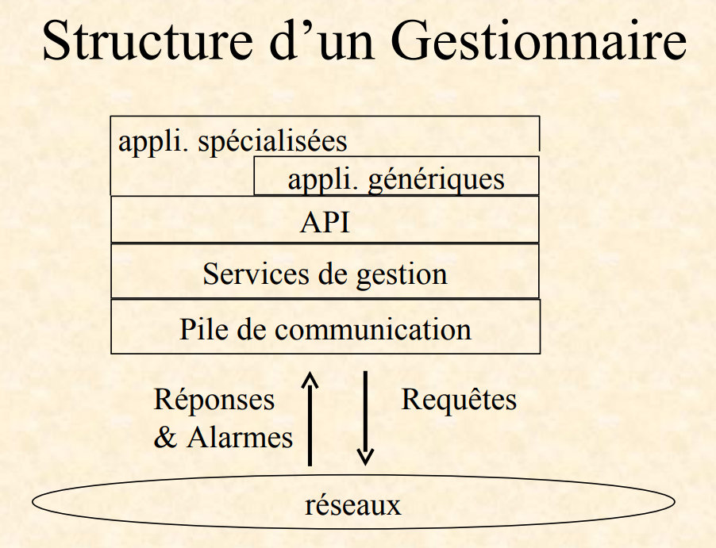

## FCAPS

The FCAPS model (defined in the ISO/IEC 10040 / ITU-T X.701 standard) describes the five main functions of network management.  
It’s an organized way of saying “what a network administrator should monitor and control.”

- `F` Fault Management → Detect, diagnose, and correct network faults.
- `C` Configuration Management → Manage the configuration of network devices (add, modify, or back up parameters).
- `A` Accounting Management → Measure resource usage for billing or cost control.
- `P` Performance Management → Monitor network performance (throughput, latency, error rates...) to ensure everything runs smoothly.
- `S` Security Management → Control access and protect network data.

## Management Paradoxes

Network management creates a paradox: you manage the network **through the same network**, so if it fails, management becomes harder.

Normally, **management traffic is much smaller** than production traffic, but when problems occur, management traffic increases, adding more load.

**Large networks** solve this by using **a separate management network**, while smaller ones use:

- **Optimization** — sending only essential management data to reduce traffic.
- **Aggregation** — grouping several pieces of information into one message.
- **Delegation** — assigning local devices to handle part of the management tasks instead of sending everything to a central system.

## Management models

Network management isn’t just about supervision (like FCAPS); it also depends on how information is exchanged, organized, and defined.

1.  `Communication layer` It’s the foundation — defines how devices talk to each other.  
    Uses protocols and services (like SNMP, CMIP, etc.) to exchange messages.
2.  `Organisation layer` Defines who does what in management.  
    The manager requests information; the agent provides it.
3.  `Information layer` Defines what kind of information is exchanged and how it is described.  
    This includes data models like **_`MIB`_** (for SNMP) or GDMO (for CMIP).
4.  `Functional layer` (Supervision) This is the FCAPS layer — what you actually manage;

## Organization model

The **organizational model** is based on a **Manager/Agent** structure, similar to a Client/Server model.  
The **manager** supervises and controls the network by communicating with **distributed agents** installed on each device through the network.

### Agents

An **agent** is a process that maintains the **managed objects** of local (or sometimes remote) **resources** on the machine.

#### structure

#### Roles

- Collect information about device resources, and Store this data in the MIB (Management Information Base),
- Respond to managers requests, and act on resources when instructed (for example, change a setting or reset an interface).

### Manager

#### API

- The `API` is the bridge between the management services and the applications.
- It provides **standard functions or commands** that applications can use to send SNMP requests, read MIB data, or display information.
- Thanks to the API, programmers don’t need to deal directly with low-level network details — they just call the API functions.  
  Example: An app can call **_getInterfaceStatus()_** instead of building an SNMP “GET” message manually.

#### Generic applications

- These are basic management tools that work for all types of devices.
- They handle general tasks like monitoring device status, viewing performance graphs, or showing alerts (Ex: dashboard).

#### Specialized applications

- These focus on specific types of equipment or services and use more detailed, vendor- or technology-specific features.
- They use the same API but provide advanced functions (Ex: a specialized app for managing routers, or one for configuring VoIP phones).

#### Roles

- Provide **communication support** with basic management operations (read, write, execute).
- Offer a platform for management applications through advanced APIs and integration tools such as databases (SGBD), user interfaces (IHM), and AI features.

### Agent notification

An agent notification (called a `TRAP`) is a message sent automatically when an event occurs, such as a **hardware problem** or when a **limit value is crossed**.  
It alerts the manager, usually **without expecting a response**.

### Proxy agent

- An **agent** that also acts as a **manager**.
- Performs translations between different management approaches (Example: one part of the network might use **SNMP**, and another part might use **CMIP** or a **vendor-specific protocol**).
- Delegation:
  - Helps reduce the manager’s workload.
  - lowers management traffic on the network.

### Information Collection

Different ways a manager collects information from the network:

- **Manual**
- **Polling** – periodic querying of managed objects
- **Notifications** – information sent by agents
