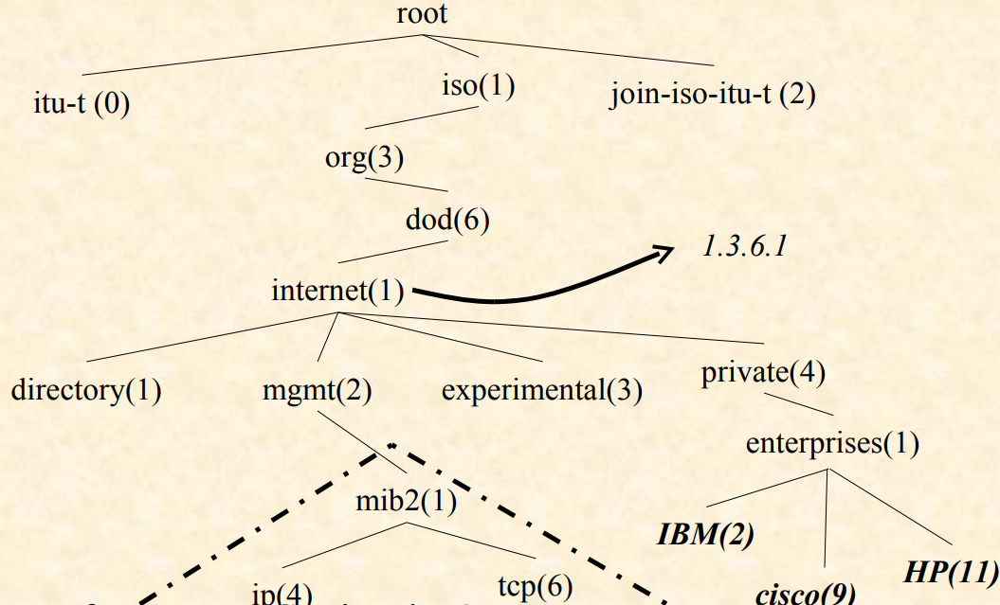

## FCAPS

The FCAPS model (defined in the ISO/IEC 10040 / ITU-T X.701 standard) describes the five main functions of network management.  
It’s an organized way of saying “what a network administrator should monitor and control.”

- `F` Fault Management → Detect, diagnose, and correct network faults.
- `C` Configuration Management → Manage the configuration of network devices (add, modify, or back up parameters).
- `A` Accounting Management → Measure resource usage for billing or cost control.
- `P` Performance Management → Monitor network performance (throughput, latency, error rates...) to ensure everything runs smoothly.
- `S` Security Management → Control access and protect network data.

## Management Paradoxes

Network management creates a paradox: you manage the network **through the same network**, so if it fails, management becomes harder.

Normally, **management traffic is much smaller** than production traffic, but when problems occur, management traffic increases, adding more load.

**Large networks** solve this by using **a separate management network**, while smaller ones use:

- **Optimization** — sending only essential management data to reduce traffic.
- **Aggregation** — grouping several pieces of information into one message.
- **Delegation** — assigning local devices to handle part of the management tasks instead of sending everything to a central system.

## Management models

Network management isn’t just about supervision (like FCAPS); it also depends on how information is exchanged, organized, and defined.

1.  `Communication layer` It’s the foundation — defines how devices talk to each other.  
    Uses protocols and services (like SNMP, CMIP, etc.) to exchange messages.
2.  `Organisation layer` Defines who does what in management.  
    The manager requests information; the agent provides it.
3.  `Information layer` Defines what kind of information is exchanged and how it is described.  
    This includes data models like **_`MIB`_** (for SNMP) or GDMO (for CMIP).
4.  `Functional layer` (Supervision) This is the FCAPS layer — what you actually manage;

## Organization model

The **organizational model** is based on a **Manager/Agent** structure, similar to a Client/Server model.  
The **manager** supervises and controls the network by communicating with **distributed agents** installed on each device through the network.

### Agents

An **agent** is a process that maintains the **managed objects** of local (or sometimes remote) **resources** on the machine.

#### structure

#### Roles

- Collect information about device resources, and Store this data in the MIB (Management Information Base),
- Respond to managers requests, and act on resources when instructed (for example, change a setting or reset an interface).

### Manager

#### API

- The `API` is the bridge between the management services and the applications.
- It provides **standard functions or commands** that applications can use to send SNMP requests, read MIB data, or display information.
- Thanks to the API, programmers don’t need to deal directly with low-level network details — they just call the API functions.  
  Example: An app can call **_getInterfaceStatus()_** instead of building an SNMP “GET” message manually.

#### Generic applications

- These are basic management tools that work for all types of devices.
- They handle general tasks like monitoring device status, viewing performance graphs, or showing alerts (Ex: dashboard).

#### Specialized applications

- These focus on specific types of equipment or services and use more detailed, vendor- or technology-specific features.
- They use the same API but provide advanced functions (Ex: a specialized app for managing routers, or one for configuring VoIP phones).

#### Roles

- Provide **communication support** with basic management operations (read, write, execute).
- Offer a platform for management applications through advanced APIs and integration tools such as databases (SGBD), user interfaces (IHM), and AI features.

### Agent notification

An agent notification (called a `TRAP`) is a message sent automatically when an event occurs, such as a **hardware problem** or when a **limit value is crossed**.  
It alerts the manager, usually **without expecting a response**.

### Proxy agent

- An **agent** that also acts as a **manager**.
- Performs translations between different management approaches (Example: one part of the network might use **SNMP**, and another part might use **CMIP** or a **vendor-specific protocol**).
- Delegation:
  - Helps reduce the manager’s workload.
  - lowers management traffic on the network.

### Information Collection

Different ways a manager collects information from the network:

- **Manual**
- **Polling** – periodic querying of managed objects
- **Notifications** – information sent by agents

# SNMP

SNMP works using three main ideas:

1. `Information model (SMI)` Defines what kind of data can be managed and gives each piece a unique ID (OID).
2. `SNMP protocol` Defines how they communicate: the manager sends requests, the agent sends responses or traps, using UDP.
3. `Data encoding (ASN.1)` Defines how the data is written so all devices understand it the same way.

## Reference Tree (OID tree)

- **Object Identifiers (OIDs)** are unique numbers used to identify every managed object in SNMP.
- These OIDs are organized in a **hierarchical** tree (like folders and subfolders).
- The tree structure ensures **uniqueness** — no two objects share the same OID.
- It’s also **flexible and scalable** — each organization or vendor can manage its own branch of the tree and add new objects without conflict.

## What is a MIB (Management Information Base)?

A MIB is a database inside a network device (router, switch, printer, etc.) that stores all the manageable information (like name, uptime, traffic, temperature…).  
It’s used by the SNMP agent to answer questions from the manager.

### Structure

- All MIB objects are organized in a hierarchical tree called the OID tree (Object Identifier tree).
- Each object has a unique ID (OID) made of numbers separated by dots (e.g., 1.3.6.1.2.1.1.5.0).
- The OID shows where the object lives in the tree — like a path or address.

### Main branches

Under 1.3.6.1 (internet), the two most important branches are:

`mgmt` - 1.3.6.1.2 - Standard objects common to all devices (MIB-II)

- Contains objects defined by IETF standards.
- Present in all SNMP devices, regardless of brand.
- Example objects:
  - sysName (1.3.6.1.2.1.1.5.0)
  - sysUpTime (1.3.6.1.2.1.1.3.0)

`private` - 1.3.6.1.4 - Vendor-specific objects (defined by manufacturers)

- Reserved for manufacturers who register their own branch under 1.3.6.1.4.1
- Each company gets a unique enterprise number
- They create custom MIBs for their specific features:
  - Cisco CPU load: 1.3.6.1.4.1.9.2.1
  - Cisco temperature: 1.3.6.1.4.1.9.2.2

# ASN.1 (Abstract Syntax Notation #1)

**ASN.1 (Abstract Syntax Notation One)** is a standard language used to describe and encode data so that different systems can exchange information in a consistent way.

The main building block in ASN.1 is a `module`, each module can:

- Define its own data types and constants (like variables and structures).
- Import types or constants from other modules.
- Export its own types or constants so other modules can use them.

### Defining a type

    <type> ::= <definition>

You are defining a new data type based on another one.

Example:

    mtu ::= INTEGER

Here, you define a new type mtu that is an INTEGER.

### Defining a constant

    <constant> <type> ::= <value>

Example:

    maxMTU INTEGER ::= 1500

### Integer with limits (constraints)

    counter ::= INTEGER (0..4294967295)

Defines a variable counter that can only take values between 0 and 4,294,967,295
(typical for 32-bit counters in SNMP).

### Integer with named values

    Interface ::= INTEGER {
      ethernet-csmacd(6),
      softwareLoopback(24)
    }

- This line defines a new type called Interface.
- It’s based on an INTEGER, but only certain integers have special names.

Those are the possible values the `Interface` type can take.

When you actually want to use it

    myInterface Interface ::= ethernet-csmacd

is the same as:

    myInterface Interface ::= 6

## Type OCTET STRING

A sequence of bytes (octets), it’s the ASN.1 way of representing text, addresses, or binary info.

#### Example

    deviceName OCTET STRING ::= "Router-Paris"

>

    macAddress OCTET STRING ::= '001122334455'H

>

    IpAddress ::= OCTET STRING (SIZE(4))
    IpAddress ::= 'C0A80105'H

This defines IpAddress as an OCTET STRING with exactly 4 bytes.

## Type OBJECT IDENTIFIER

    <name> OBJECT IDENTIFIER ::= { parent number }

Example

    mgmt OBJECT IDENTIFIER ::= { internet 2 }

>

    sysName OBJECT-TYPE
    SYNTAX      DisplayString (SIZE (0..255))
    MAX-ACCESS  read-only
    STATUS      current
    DESCRIPTION "Device name"
    ::= { system 5 }

`system` = 1.3.6.1.2.1.1, `sysName` = 1.3.6.1.2.1.1.5

## SEQUENCE (structured type)

A SEQUENCE is an ordered list of fields, where each field has its own name and type.

    IpRouteTableEntry ::= SEQUENCE {
        ipRouteDest     IpAddress,
        ipRouteNextHop  IpAddress
    }

## SEQUENCE OF (repeated structure)

A list of multiple elements of the same type.

    IpRouteTable ::= SEQUENCE OF IpRouteTableEntry

## MACRO

A MACRO is a mechanism that allows you to create new notation formats in ASN.1.  
SNMP uses macros to define how MIB objects should be written.  
The most important macro in SNMP is OBJECT-TYPE.

    sysContact OBJECT-TYPE
    SYNTAX      DisplayString
    ACCESS      read-write
    STATUS      mandatory
    ::= { system 4 }
